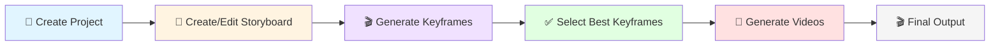

# CINDERGRACE GUI Documentation

**Version:** v0.5.1
**Last Updated:** December 13, 2025
**Purpose:** Technical documentation for AI/LLM-assisted development

---

## 📚 Documentation Structure

This documentation is designed for **change management** workflows. For any modification, read only the relevant documentation:

```
docs/
├── README.md                    # ← You are here (Architecture overview)
├── ROADMAP.md                   # Feature planning (v0.6.0 - v1.0.0)
├── BACKLOG.md                   # Deferred issues and technical debt
├── templates/
│   └── CHANGE_TEMPLATE.md       # Template for documenting changes
├── addons/
│   ├── PROJECT.md              # 📁 Project Panel
│   ├── STORYBOARD_EDITOR.md    # 📖 Storyboard Editor
│   ├── KEYFRAME_GENERATOR.md   # 🎬 Keyframe Generator
│   ├── KEYFRAME_SELECTOR.md    # ✅ Keyframe Selector
│   ├── VIDEO_GENERATOR.md      # 🎥 Video Generator
│   ├── TEST_COMFY.md           # 🧪 Test ComfyUI
│   └── SETTINGS.md             # ⚙️ Settings Panel
└── services/
    ├── KEYFRAME_SERVICE.md      # Keyframe generation business logic
    ├── VIDEO_SERVICE.md         # Video generation business logic
    └── SELECTION_SERVICE.md     # Selection export business logic
```

---

## 🎯 Quick Navigation: What to Read for Common Tasks

| Task | Required Reading |
|------|------------------|
| **Add new addon/tab** | This file (Architecture) + any addon doc as template |
| **Modify keyframe generation** | `addons/KEYFRAME_GENERATOR.md` + `services/KEYFRAME_SERVICE.md` |
| **Modify video generation** | `addons/VIDEO_GENERATOR.md` + `services/VIDEO_SERVICE.md` |
| **Modify selection export** | `addons/KEYFRAME_SELECTOR.md` + `services/SELECTION_SERVICE.md` |
| **Change storyboard editing** | `addons/STORYBOARD_EDITOR.md` |
| **Fix project creation** | `addons/PROJECT.md` |
| **Modify settings/config** | `addons/SETTINGS.md` |
| **Change ComfyUI workflow updates** | Addon using it + Architecture (ComfyAPI section below) |
| **Add new validation rule** | This file (Domain Layer) + affected addon doc |
| **Add new model/domain object** | This file (Domain Layer) |
| **Change file storage paths** | This file (ProjectStore) + affected addon doc |
| **Modify progress tracking** | Addon doc + This file (Progress Tracking) |
| **Add new workflow preset** | `addons/SETTINGS.md` + This file (WorkflowRegistry) |
| **Fix test failures** | This file (Testing) + affected component doc |
| **Plan new feature** | `ROADMAP.md` + `templates/CHANGE_TEMPLATE.md` |
| **Fix known bug** | `BACKLOG.md` + affected component docs |

---

## 🏗️ Architecture Overview

CINDERGRACE GUI follows a **layered architecture** with clear separation of concerns:

```
┌─────────────────────────────────────────────────────────────┐
│                        User Interface                        │
│                      (Gradio Browser UI)                     │
└─────────────────────────────────────────────────────────────┘
                              ▼
┌─────────────────────────────────────────────────────────────┐
│                      Addon Layer (UI)                        │
│  - Gradio component definitions                             │
│  - Event handler wiring                                      │
│  - Input/output formatting                                   │
│  - State management (gr.State)                               │
│                                                              │
│  Files: addons/*.py                                          │
└─────────────────────────────────────────────────────────────┘
                              ▼
┌─────────────────────────────────────────────────────────────┐
│                   Service Layer (Business Logic)             │
│  - Orchestration of workflows                                │
│  - Business rule enforcement                                 │
│  - Multi-step operations                                     │
│  - Error handling and retry logic                            │
│                                                              │
│  Files: services/**/*.py                                     │
└─────────────────────────────────────────────────────────────┘
                              ▼
┌─────────────────────────────────────────────────────────────┐
│              Infrastructure Layer (Core Services)            │
│  - ComfyUI API client (REST + WebSocket)                     │
│  - File I/O operations                                       │
│  - Configuration management                                  │
│  - Project/workflow registry                                 │
│  - State persistence                                         │
│  - Logging and error handling                                │
│                                                              │
│  Files: infrastructure/**/*.py                               │
└─────────────────────────────────────────────────────────────┘
                              ▼
┌─────────────────────────────────────────────────────────────┐
│                    Domain Layer (Models)                     │
│  - Domain models (dataclasses)                               │
│  - Validation rules (Pydantic)                               │
│  - Business entities                                         │
│  - Custom exceptions                                         │
│                                                              │
│  Files: domain/**/*.py                                       │
└─────────────────────────────────────────────────────────────┘
                              ▼
┌─────────────────────────────────────────────────────────────┐
│                      External Systems                        │
│  - ComfyUI (http://127.0.0.1:8188)                          │
│  - File System (<ComfyUI>/output/<project>/)                │
└─────────────────────────────────────────────────────────────┘
```

### Design Principles

1. **Project-Centric Storage**: All artifacts stored in `<ComfyUI>/output/<project-slug>/` (not in GUI directory)
2. **Storyboard-Driven**: JSON storyboard is the source of truth for all operations
3. **Service Extraction**: Business logic separated from UI (addons delegate to services)
4. **Content-Based Naming**: Semantic filenames using `filename_base` from storyboard
5. **State Persistence**: UI state survives browser refresh (e.g., Video Generator `_state.json`)
6. **Validation First**: Pydantic models validate all inputs before processing

---

## 📊 Overall Pipeline Workflow

The pipeline transforms a storyboard into finished video clips through 5 phases:



### Phase 0: Project Management (📁 Projekt)

**Purpose:** Create and manage project workspace

**Key Actions:**
- Create new project → Creates `<ComfyUI>/output/<slug>/` directory
- Select existing project → Sets active project in `settings.json`
- View project metadata → Reads `project.json`

**Artifacts Created:**
- `<ComfyUI>/output/<project-slug>/project.json`
- Subdirectories: `keyframes/`, `storyboards/`, `selected/`, `video/`, `checkpoints/`

**See:** `addons/PROJECT.md`

---

### Phase 1: Storyboard Creation (📖 Storyboard Editor)

**Purpose:** Define shots with prompts, resolution, duration, camera movement

**Key Actions:**
- Create new storyboard → JSON file in `<project>/storyboards/`
- Edit shots → Add/remove/reorder/duplicate
- Set parameters → Prompt, resolution, duration, wan_motion
- Save → Updates `project.json` with storyboard reference

**Artifacts Created:**
- `<project>/storyboards/<name>.json`

**Storyboard Format:**
```json
{
  "project": "Project Name",
  "shots": [
    {
      "shot_id": "001",
      "filename_base": "cathedral-interior",
      "description": "Opening shot",
      "prompt": "gothic cathedral interior, cinematic lighting",
      "negative_prompt": "blurry, low quality",
      "width": 1024,
      "height": 576,
      "duration": 4.0,
      "camera_movement": "slow_push",
      "wan_motion": {
        "type": "macro_dolly",
        "strength": 0.6,
        "notes": "Small forward movement"
      }
    }
  ]
}
```

**See:** `addons/STORYBOARD_EDITOR.md`

---

### Phase 2: Keyframe Generation (🎬 Keyframe Generator)

**Purpose:** Generate multiple variant keyframes per shot using Flux Dev

**Key Actions:**
1. Load storyboard from project
2. Select Flux workflow template
3. Configure variants (1-10) and seed
4. Generate → For each shot × variant:
   - Inject prompt, resolution, seed into workflow
   - Queue to ComfyUI
   - Monitor via WebSocket
   - Copy output from `<ComfyUI>/output/` to `<project>/keyframes/`

**Artifacts Created:**
- `<project>/keyframes/<filename_base>_v<N>_00001_.png`
- `<project>/checkpoints/<checkpoint_id>.json` (if stopped)

**Checkpoint/Resume:**
- Stop button saves checkpoint with completed shots
- Resume button continues from last checkpoint

**See:** `addons/KEYFRAME_GENERATOR.md`, `services/KEYFRAME_SERVICE.md`

---

### Phase 3: Keyframe Selection (✅ Keyframe Selector)

**Purpose:** Select best variant per shot for video generation

**Key Actions:**
1. Load storyboard
2. Collect variants by `filename_base` (grouped per shot)
3. Display gallery with radio selection
4. Export → Creates `selected_keyframes.json` + copies PNGs to `selected/`

**Artifacts Created:**
- `<project>/selected/selected_keyframes.json`
- `<project>/selected/<filename_base>_v<N>_00001_.png` (copies)

**Selection Format:**
```json
{
  "project": "Project Name",
  "total_shots": 5,
  "exported_at": "2025-12-13T10:15:01",
  "selections": [
    {
      "shot_id": "001",
      "filename_base": "cathedral-interior",
      "selected_variant": 2,
      "selected_file": "cathedral-interior_v2_00001_.png",
      "source_path": "/path/to/keyframes/...",
      "export_path": "/path/to/selected/..."
    }
  ]
}
```

**See:** `addons/KEYFRAME_SELECTOR.md`, `services/SELECTION_SERVICE.md`

---

### Phase 4: Video Generation (🎥 Video Generator)

**Purpose:** Generate video clips from selected keyframes using Wan 2.2

**Key Actions:**
1. Load storyboard + selection JSON
2. Build generation plan:
   - Shots ≤3s: Single segment
   - Shots >3s: Split into 3s segments with LastFrame chaining
3. For each segment:
   - Inject startframe, prompt, duration, resolution into Wan workflow
   - Queue to ComfyUI
   - Monitor via WebSocket
   - Extract LastFrame if needed for next segment
   - Copy video to `<project>/video/`

**Artifacts Created:**
- `<project>/video/shot_<id>_seg_<N>.mp4`
- `<project>/video/_startframes/<shot_id>_lastframe_<seg>.png` (cached)
- `<project>/video/_state.json` (UI state persistence)

**LastFrame Chaining (for shots >3s):**
```
Shot 001 (5 seconds):
  Segment 0: Startframe = selected keyframe → 3s video → Extract LastFrame
  Segment 1: Startframe = LastFrame from Seg 0 → 2s video (trimmed from 3s)
```

**See:** `addons/VIDEO_GENERATOR.md`, `services/VIDEO_SERVICE.md`

---

### Phase 5: Testing & Configuration

**Test ComfyUI (🧪):**
- Connection testing
- Simple image generation test
- Diagnostics

**Settings (⚙️):**
- ComfyUI URL configuration
- ComfyUI root path (for model validation)
- Workflow preset management

**See:** `addons/TEST_COMFY.md`, `addons/SETTINGS.md`

---

## 🔧 Core Infrastructure Components

### ComfyUI API Client

**Location:** `infrastructure/comfy_api/comfy_api_client.py`

**Purpose:** REST + WebSocket wrapper for ComfyUI API

**Key Methods:**
```python
class ComfyUIAPI:
    def test_connection(self) -> dict
    def load_workflow(self, path: str) -> dict
    def update_workflow_params(self, workflow: dict, **params) -> dict
    def queue_prompt(self, workflow: dict) -> str  # Returns prompt_id
    def monitor_progress(self, prompt_id: str, callback=None) -> dict
    def get_output_images(self, prompt_id: str) -> List[dict]
    def get_history(self, prompt_id: str) -> dict
```

**Workflow Update Strategy:**
Uses node updaters (Strategy Pattern) to modify workflow JSON:
- `CLIPTextEncodeUpdater` - Update text prompts
- `EmptyLatentImageUpdater` - Update resolution
- `KSamplerUpdater` - Update seed, steps, cfg
- `LoadImageUpdater` - Update startframe path
- `HunyuanVideoSamplerUpdater` - Update num_frames (duration)
- `SaveImageUpdater` - Update filename_prefix

**See:** Addon docs for usage examples

---

### ProjectStore

**Location:** `infrastructure/project_store.py`

**Purpose:** Manage project metadata and file paths

**Key Methods:**
```python
class ProjectStore:
    def create_project(self, name: str, slug: str) -> dict
    def get_active_project(self, refresh: bool = False) -> Optional[dict]
    def set_active_project(self, slug: str) -> None
    def list_projects(self) -> List[dict]
    def project_path(self, project: dict, subdir: str = None) -> str
    def ensure_dir(self, project: dict, subdir: str) -> str
```

**Project Metadata (`project.json`):**
```json
{
  "name": "My Project",
  "slug": "my-project",
  "created_at": "2025-12-13T10:00:00",
  "path": "/path/to/ComfyUI/output/my-project",
  "storyboard": "storyboard_v1.json",
  "description": "Optional description"
}
```

**Active Project Storage:**
Stored in `config/settings.json` under key `active_project_slug`

---

### ConfigManager

**Location:** `infrastructure/config_manager.py`

**Purpose:** Manage GUI configuration (settings.json)

**Key Methods:**
```python
class ConfigManager:
    def get(self, key: str, default=None) -> Any
    def set(self, key: str, value: Any) -> None
    def refresh(self) -> None
    def get_comfy_url(self) -> str
    def get_comfy_root(self) -> str
    def get_current_storyboard(self) -> Optional[str]
    def get_resolution_tuple(self) -> Tuple[int, int]
```

**Config File (`config/settings.json`):**
```json
{
  "comfy_url": "http://127.0.0.1:8188",
  "comfy_root": "/path/to/ComfyUI",
  "active_project_slug": "my-project",
  "default_resolution": "1024x576",
  "current_storyboard": "storyboard_v1.json"
}
```

---

### WorkflowRegistry

**Location:** `infrastructure/workflow_registry.py`

**Purpose:** Manage workflow templates and presets

**Key Methods:**
```python
class WorkflowRegistry:
    def list_presets(self, category: str = None) -> List[str]
    def get_files(self, category: str) -> List[str]
    def get_default(self, category: str) -> Optional[str]
    def load_preset_config(self) -> dict
    def save_raw(self, content: str) -> str
```

**Workflow Presets (`config/workflow_presets.json`):**
```json
{
  "flux": [
    "flux_test_simple.json",
    "flux_keyframe_1.json"
  ],
  "wan": [
    "Wan 2.2 14B i2v.json"
  ]
}
```

**Template Location:** `config/workflow_templates/*.json`

---

### StateStore

**Location:** `infrastructure/state_store.py`

**Purpose:** Persist UI state across browser refreshes

**Used By:** Video Generator (other addons could adopt)

**Key Methods:**
```python
class VideoGeneratorStateStore:
    def configure(self, state_file_path: str) -> None
    def update(self, **state_fields) -> None
    def load(self) -> dict
    def clear(self) -> None
```

**Example State (`<project>/video/_state.json`):**
```json
{
  "storyboard_file": "storyboard_v1.json",
  "selection_file": "selected_keyframes.json",
  "workflow_file": "Wan 2.2 14B i2v.json",
  "last_video_path": "/path/to/shot_005_seg_0.mp4",
  "updated_at": "2025-12-13T14:30:00"
}
```

---

### StoryboardService

**Location:** `domain/storyboard_service.py`

**Purpose:** Load and validate storyboards

**Key Methods:**
```python
def load_storyboard(config: ConfigManager, storyboard_path: str = None) -> Storyboard
def load_from_config(config: ConfigManager) -> Storyboard
```

**Returns:** `Storyboard` dataclass with typed access to shots

---

## 🎨 Domain Layer

### Models

**Location:** `domain/models.py`

**Key Models:**
```python
@dataclass
class Shot:
    shot_id: str
    filename_base: str
    description: str
    prompt: str
    negative_prompt: str = ""
    width: int = 1024
    height: int = 576
    duration: float = 3.0
    camera_movement: str = "static"
    wan_motion: Optional[dict] = None

@dataclass
class Storyboard:
    project: str
    shots: List[Shot]
    raw: dict  # Original JSON for passthrough

@dataclass
class ProjectMetadata:
    name: str
    slug: str
    created_at: str
    path: str
    storyboard: Optional[str] = None
    description: Optional[str] = None
```

---

### Validators

**Location:** `domain/validators/domain_validators.py`

**Purpose:** Pydantic models for input validation

**Key Validators:**
```python
class KeyframeGenerationInputs(BaseModel):
    num_variants: int = Field(ge=1, le=10)
    base_seed: int = Field(ge=0, le=2147483647)
    workflow_path: str

class VideoGenerationInputs(BaseModel):
    storyboard_path: str
    selection_path: str
    workflow_path: str

class SelectionInputs(BaseModel):
    storyboard_path: str
    keyframes_dir: str
```

**Usage in Addons:**
```python
try:
    validated = KeyframeGenerationInputs(
        num_variants=variants,
        base_seed=seed,
        workflow_path=workflow_path
    )
except ValidationError as e:
    return None, f"Validation error: {e}"
```

---

### Exceptions

**Location:** `domain/exceptions.py`

**Custom Exception Hierarchy:**
```python
class CindergraceError(Exception):
    """Base exception for all CINDERGRACE errors"""

class ProjectCreationError(CindergraceError):
    """Failed to create project"""

class StoryboardLoadError(CindergraceError):
    """Failed to load storyboard"""

class WorkflowUpdateError(CindergraceError):
    """Failed to update workflow"""

class ComfyAPIError(CindergraceError):
    """ComfyUI API communication error"""

class ValidationError(CindergraceError):
    """Input validation failed"""
```

---

## 🧪 Testing Strategy

### Test Structure

```
tests/
├── unit/
│   ├── test_addons_helpers.py        # Addon helper methods
│   ├── test_addons_imports.py        # Addon import smoke tests
│   ├── services/
│   │   ├── keyframe/
│   │   │   ├── test_keyframe_service.py
│   │   │   └── test_keyframe_generation_service.py
│   │   ├── selection/
│   │   │   └── test_selection_service.py
│   │   └── video/
│   │       ├── test_video_service.py
│   │       ├── test_video_generation_service.py
│   │       ├── test_video_plan_builder.py
│   │       └── test_last_frame_extractor.py
│   ├── infrastructure/
│   │   ├── test_config_manager.py
│   │   ├── test_project_store.py
│   │   ├── test_workflow_registry.py
│   │   ├── test_state_store.py
│   │   └── comfy_api/
│   │       ├── test_comfy_api_client.py
│   │       └── node_updaters/
│   │           └── test_*.py
│   └── domain/
│       ├── test_models.py
│       ├── test_storyboard_service.py
│       └── validators/
│           └── test_domain_validators.py
└── integration/
    └── (future integration tests)
```

### Running Tests

```bash
# All tests
pytest

# Specific marker
pytest -m unit
pytest -m integration

# Coverage report
pytest --cov=. --cov-report=html

# Specific file
pytest tests/unit/services/keyframe/test_keyframe_service.py
```

### Current Coverage: **75%** ✅

**High Coverage (>90%):**
- All services (Keyframe, Video, Selection)
- ComfyAPI client and updaters
- ProjectStore, ConfigManager, WorkflowRegistry
- Domain validators and models

**Medium Coverage (70-90%):**
- Addons (UI-heavy, harder to test)
- StateStore

**See:** `../TESTING.md` for detailed coverage report

---

## 🔄 Common Development Patterns

### Adding a New Input Field to an Addon

**Example:** Add "cfg_scale" input to Keyframe Generator

**Steps:**
1. Read: `addons/KEYFRAME_GENERATOR.md`
2. Add Gradio component in `render()`:
   ```python
   cfg_scale = gr.Slider(
       minimum=1.0, maximum=20.0, value=7.0, step=0.1,
       label="CFG Scale"
   )
   ```
3. Add to event handler signature:
   ```python
   def start_generation(self, storyboard_file, workflow_file, variants, seed, cfg_scale):
   ```
4. Add validation (if needed) in `_validate_generation_inputs()`
5. Pass to service layer:
   ```python
   self.generation_service.run_generation(..., cfg_scale=cfg_scale)
   ```
6. Update service to accept parameter
7. Update workflow updater to inject parameter
8. Write tests

---

### Adding a New Workflow Node Updater

**Example:** Support a new ComfyUI node type

**Steps:**
1. Read: This file (ComfyAPI section)
2. Create new updater class:
   ```python
   # infrastructure/comfy_api/node_updaters/my_node_updater.py
   from .base import NodeUpdater

   class MyNodeUpdater(NodeUpdater):
       NODE_TYPE = "MyNodeClass"

       def update(self, workflow: dict, params: dict) -> dict:
           nodes = self.find_nodes_by_class(workflow, self.NODE_TYPE)
           for node in nodes:
               if "my_param" in params:
                   node["inputs"]["my_param"] = params["my_param"]
           return workflow
   ```
3. Register in `comfy_api_client.py`:
   ```python
   from .node_updaters.my_node_updater import MyNodeUpdater

   # In update_workflow_params():
   updaters = [
       # ... existing updaters
       MyNodeUpdater(),
   ]
   ```
4. Write tests in `tests/unit/infrastructure/comfy_api/node_updaters/test_my_node_updater.py`

---

### Adding a New Service

**Example:** Create a new service for a new addon

**Steps:**
1. Read: Any existing service doc as template (e.g., `services/KEYFRAME_SERVICE.md`)
2. Create service file:
   ```python
   # services/my_feature/my_service.py
   from infrastructure.logger import get_logger
   from infrastructure.error_handler import handle_errors

   logger = get_logger(__name__)

   class MyService:
       def __init__(self, project_store, config):
           self.project_store = project_store
           self.config = config

       @handle_errors("My operation failed")
       def do_something(self, param1, param2):
           logger.info(f"Starting operation with {param1}")
           # Implementation
           return result
   ```
3. Write comprehensive unit tests (target: 85%+ coverage)
4. Document in `docs/services/MY_SERVICE.md`
5. Use in addon:
   ```python
   from services.my_feature.my_service import MyService

   class MyAddon(BaseAddon):
       def __init__(self):
           super().__init__(...)
           self.my_service = MyService(self.project_store, self.config)
   ```

---

### Adding a New Addon/Tab

**Example:** Create a new addon for a new feature

**Steps:**
1. Read: This file (Architecture) + any addon doc as template
2. Create addon file:
   ```python
   # addons/my_addon.py
   from addons.base_addon import BaseAddon
   import gradio as gr

   class MyAddon(BaseAddon):
       def __init__(self):
           super().__init__(
               name="My Addon",
               description="What this addon does"
           )
           # Initialize dependencies

       def get_tab_name(self) -> str:
           return "🔧 My Addon"

       def render(self) -> gr.Blocks:
           with gr.Blocks() as interface:
               # UI components
               pass
           return interface
   ```
3. Register in `addons/__init__.py`:
   ```python
   from addons.my_addon import MyAddon

   AVAILABLE_ADDONS = [
       # ... existing addons
       MyAddon,
   ]
   ```
4. Create service layer (if needed)
5. Write tests
6. Document in `docs/addons/MY_ADDON.md`

---

## 📦 File Structure Reference

```
cindergrace_gui/
├── main.py                          # Application entry point
├── addons/                          # UI layer (7 addons)
│   ├── base_addon.py
│   ├── project_panel.py
│   ├── storyboard_editor.py
│   ├── keyframe_generator.py
│   ├── keyframe_selector.py
│   ├── video_generator.py
│   ├── test_comfy_flux.py
│   └── settings_panel.py
├── services/                        # Business logic layer
│   ├── keyframe/
│   │   ├── keyframe_service.py
│   │   └── keyframe_generation_service.py
│   ├── selection/
│   │   └── selection_service.py
│   └── video/
│       ├── video_service.py
│       ├── video_generation_service.py
│       ├── video_plan_builder.py
│       └── last_frame_extractor.py
├── infrastructure/                  # Core services layer
│   ├── config_manager.py
│   ├── project_store.py
│   ├── workflow_registry.py
│   ├── state_store.py
│   ├── logger.py
│   ├── error_handler.py
│   ├── progress_tracker.py
│   └── comfy_api/
│       ├── comfy_api_client.py
│       └── node_updaters/
│           ├── base.py
│           ├── clip_text_encode_updater.py
│           ├── empty_latent_image_updater.py
│           ├── ksampler_updater.py
│           ├── load_image_updater.py
│           ├── hunyuan_video_sampler_updater.py
│           └── save_image_updater.py
├── domain/                          # Domain models layer
│   ├── models.py
│   ├── storyboard_service.py
│   ├── exceptions.py
│   └── validators/
│       └── domain_validators.py
├── tests/                           # Test suite
│   └── unit/
│       ├── test_addons_*.py
│       ├── services/
│       ├── infrastructure/
│       └── domain/
├── config/                          # Configuration files
│   ├── settings.json
│   ├── workflow_presets.json
│   └── workflow_templates/
├── logs/                            # Log files (auto-generated)
│   └── pipeline.log
└── docs/                            # Documentation (you are here)
    ├── README.md
    ├── ROADMAP.md
    ├── BACKLOG.md
    ├── templates/
    ├── addons/
    └── services/
```

**Project Output Structure:**
```
<ComfyUI>/output/<project-slug>/
├── project.json                     # Project metadata
├── storyboards/                     # Storyboard JSON files
│   └── *.json
├── keyframes/                       # Generated keyframes
│   └── <filename_base>_v<N>_*.png
├── checkpoints/                     # Checkpoint files for resume
│   └── checkpoint_*.json
├── selected/                        # Selected keyframes + selection JSON
│   ├── selected_keyframes.json
│   └── *.png
└── video/                           # Generated videos
    ├── shot_*_seg_*.mp4
    ├── _startframes/                # LastFrame cache
    │   └── *_lastframe_*.png
    └── _state.json                  # UI state persistence
```

---

## 🛠️ Technology Stack

**Core Framework:**
- **Gradio 6.0+** - Web UI framework
- **Python 3.10+** - Programming language

**External Services:**
- **ComfyUI** - AI image/video generation backend
- **Flux Dev** - Text-to-image model (keyframes)
- **Wan 2.2 (HunyuanVideo)** - Image-to-video model (videos)

**Libraries:**
- **Pydantic** - Data validation
- **pytest** - Testing framework
- **websockets** - Real-time progress monitoring
- **ffmpeg** - LastFrame extraction (video segmentation)

**Development Tools:**
- **pytest-cov** - Coverage reporting (75% target achieved)
- **pre-commit** - Code quality hooks
- **GitHub Actions** - CI/CD pipeline

---

## 🔍 Debugging and Logging

### Log Files

**Location:** `logs/pipeline.log`

**Rotation:** 10MB per file, keeps last 5 files

**Log Levels:**
- INFO: Normal operations
- WARNING: Unusual but handled situations
- ERROR: Errors with stack traces
- DEBUG: Verbose debugging (not in production)

**Usage in Code:**
```python
from infrastructure.logger import get_logger

logger = get_logger(__name__)

logger.info("Starting operation")
logger.warning("Unusual condition detected")
logger.error("Operation failed", exc_info=True)  # With stack trace
```

### Error Handling

**Decorator Pattern:**
```python
from infrastructure.error_handler import handle_errors

@handle_errors("Custom error message")
def my_function():
    # Automatically logs errors and returns formatted error message
    pass
```

**Custom Exceptions:**
```python
from domain.exceptions import ProjectCreationError

raise ProjectCreationError("Project name cannot be empty")
```

---

## 📝 Change Management Workflow

### Making a Change

1. **Identify affected components** using navigation matrix above
2. **Create change document** from `templates/CHANGE_TEMPLATE.md`
3. **Read required documentation** (this file + component docs)
4. **Implement changes** following architecture patterns
5. **Write/update tests** (maintain 75%+ coverage)
6. **Update documentation** if needed
7. **Update CHANGELOG.md** with change entry
8. **Test manually** using GUI
9. **Commit with descriptive message**

### Change Documentation

See `templates/CHANGE_TEMPLATE.md` for structured change documentation format.

---

## 🔗 External Documentation

**User Documentation:**
- `../README.md` - User guide and quickstart
- `../CHANGELOG.md` - Version history

**Technical Documentation:**
- `../GUI_FRAMEWORK_README.md` - Original architecture document
- `../CINDERGRACE_PIPELINE_README.md` - Pipeline overview
- `../TESTING.md` - Test coverage details
- `../LOGGING_ERROR_HANDLING.md` - Logging and error handling guide

**Project Planning:**
- `ROADMAP.md` - Feature roadmap (v0.6.0 - v1.0.0)
- `BACKLOG.md` - Known issues and technical debt

**Repository:**
- `.pre-commit-config.yaml` - Code quality hooks
- `.github/workflows/ci.yml` - CI/CD pipeline

---

## 📮 Contributing

For contribution guidelines, see the main repository README.

For architectural decisions or questions, refer to the component-specific documentation in `addons/` and `services/`.

---

**Last Updated:** December 13, 2025
**Maintained By:** Architecture Team
**Version:** v0.5.1
