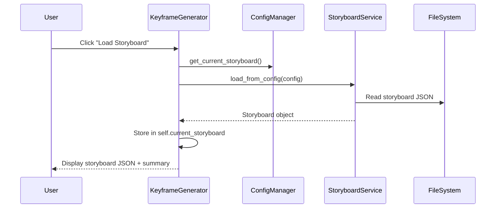

# 🎬 Keyframes (Keyframe Generator)

**Tab Name:** 🎬 Keyframes
**File:** `addons/keyframe_generator.py`
**Lines:** 444 (after Sprint 2 refactoring, down from 919)
**Services:** KeyframeGenerationService, KeyframeService
**State:** Stateful (storyboard in memory, checkpoints on disk)

---

## Quick Reference

| Property | Value |
|----------|-------|
| **Purpose** | Generate multiple keyframe variant images per shot using Flux Dev |
| **Main Files** | `addons/keyframe_generator.py`, `services/keyframe/keyframe_generation_service.py`, `services/keyframe/keyframe_service.py` |
| **Dependencies** | KeyframeGenerationService, KeyframeService, ProjectStore, ConfigManager, WorkflowRegistry, ComfyUIAPI |
| **State Management** | Storyboard in memory, checkpoints in `<project>/checkpoints/` |
| **Output Location** | `<project>/keyframes/<filename_base>_v<N>_00001_.png` |

---

## Functionality

The Keyframe Generator enables:

1. **Load Storyboard** - Load storyboard JSON from active project
2. **Configure Generation** - Set variants per shot (1-10), base seed
3. **Select Workflow** - Choose Flux workflow template
4. **Start Generation** - Generate keyframes for all shots × variants
5. **Stop/Resume** - Experimental checkpoint-based pause/resume (not refresh-safe yet)
6. **View Results** - Display generated keyframes in gallery

**Key Workflow:**
```
Load Storyboard
  → For each shot in storyboard:
      → For each variant (1-N):
          → Inject prompt, resolution, seed into Flux workflow
          → Queue to ComfyUI
          → Monitor progress via WebSocket
          → Copy output from ComfyUI to <project>/keyframes/
          → Display in gallery
```

**Content-Based Filenames:**
Output files use `filename_base` from storyboard:
- Shot with `filename_base: "cathedral-interior"` → `cathedral-interior_v1_00001_.png`, `cathedral-interior_v2_00001_.png`, etc.

---

## Architecture

### UI Components

```python
# Setup Section
project_status = gr.Markdown()  # Active project display
comfy_url = gr.Textbox()  # ComfyUI URL (read-only)
storyboard_info_md = gr.Markdown()  # Current storyboard summary
workflow_dropdown = gr.Dropdown()  # Flux workflow selection
refresh_workflow_btn = gr.Button("↻")
variants_per_shot = gr.Slider(1-10)  # Number of variants
base_seed = gr.Number(0-2147483647)  # Starting seed
load_storyboard_btn = gr.Button("📖 Load Storyboard")
storyboard_info = gr.Code()  # Full storyboard JSON (accordion)

# Run Section
start_btn = gr.Button("▶️ Start Generation")
stop_btn = gr.Button("⏹️ Stop (experimentell)")
resume_btn = gr.Button("⏯️ Resume (deaktiviert)")  # Disabled, not refresh-safe
status_text = gr.Markdown()  # Current status
progress_details = gr.Markdown()  # Detailed progress
checkpoint_info = gr.JSON()  # Checkpoint metadata

# Gallery Section
current_shot_display = gr.Markdown()  # "Shot 001: cathedral-interior"
keyframe_gallery = gr.Gallery()  # Generated images
```

### Event Handlers

#### 1. `load_storyboard() -> Tuple[Code, Markdown]`

**Purpose:** Load storyboard from active project

**Flow:**


**Returns:**
- Storyboard JSON (Code component)
- Summary markdown: "5 shots, total duration: 17.5s"

**Error Handling:**
- Returns error message if no project active
- Returns error message if storyboard file not found
- Logs error with stack trace

---

#### 2. `start_generation(variants, seed, workflow_path) -> Generator[Tuple]`

**Purpose:** Start keyframe generation for all shots

**Delegation to Services:**
This event handler delegates to `KeyframeGenerationService.run_generation()`:

**Flow:**
```python
def start_generation(self, variants, seed, workflow_path):
    # Validate inputs
    validated, error = self._validate_generation_inputs(variants, seed, workflow_path)
    if error:
        yield error_message

    # Delegate to service
    for update in self.generation_service.run_generation(
        storyboard=self.current_storyboard,
        workflow_path=workflow_path,
        num_variants=variants,
        base_seed=seed
    ):
        # update is a tuple: (status_md, progress_md, gallery_images, shot_display, checkpoint)
        yield update
```

**Service Layer (KeyframeGenerationService):**
See `services/KEYFRAME_SERVICE.md` for detailed service logic.

**High-Level Steps:**
1. Validate inputs (variants 1-10, seed 0-2147483647, workflow exists)
2. For each shot in storyboard:
   - For each variant 1-N:
     - Increment seed (base_seed + variant - 1)
     - Inject prompt, resolution, seed into workflow
     - Queue to ComfyUI via ComfyUIAPI
     - Monitor progress via WebSocket
     - Download output images
     - Copy to `<project>/keyframes/` with content-based name
     - Yield progress update to UI
3. Return final status

**Yields (Progressive Updates):**
Each yield updates the UI in real-time:
```python
(
    status_markdown,        # "Generating shot 3/5, variant 2/4"
    progress_details_md,   # "Shot: cathedral, Seed: 2001, Status: Processing"
    gallery_images,        # List of image paths for gallery
    current_shot_display,  # "Shot 003: cathedral-interior"
    checkpoint_json        # Checkpoint metadata (for resume)
)
```

---

#### 3. `stop_generation() -> str`

**Purpose:** Stop running generation (experimental)

**Flow:**
```
User clicks Stop
  → Set stop flag in KeyframeService
  → Service detects flag, stops iteration
  → Saves checkpoint with completed shots
  → Returns "Stopped at shot X, variant Y"
```

**Checkpoint Format:**
```json
{
  "checkpoint_id": "ckpt_20251213_143000",
  "created_at": "2025-12-13T14:30:00",
  "storyboard_file": "storyboard_v1.json",
  "workflow_file": "flux_keyframe_1.json",
  "num_variants": 4,
  "base_seed": 2000,
  "completed_shots": ["001", "002"],
  "current_shot": "003",
  "current_variant": 2
}
```

**Saved To:** `<project>/checkpoints/<checkpoint_id>.json`

**Known Issues:**
- ⚠️ **Not refresh-safe**: Browser refresh loses in-memory state
- ⚠️ **Resume disabled**: Needs state persistence (see BACKLOG.md #002)

---

#### 4. `resume_generation() -> Generator[Tuple]`

**Status:** **Disabled** (not refresh-safe)

**Planned Implementation (v0.7.0):**
```
User clicks Resume
  → Load checkpoint from <project>/checkpoints/
  → Restore storyboard, workflow, parameters
  → Continue from last completed shot/variant
  → Yields progress updates
```

**Blockers:**
- Needs StateStore integration (like Video Generator)
- Must persist stop flag and checkpoint ID across refresh
- See BACKLOG.md Issue #002

---

### Service Integration

**KeyframeGenerationService** (`services/keyframe/keyframe_generation_service.py`)
- `run_generation(storyboard, workflow_path, num_variants, base_seed)` - Main orchestration
- Returns generator yielding progress updates
- Handles ComfyUI interaction, file copying, error handling

**KeyframeService** (`services/keyframe/keyframe_service.py`)
- `prepare_checkpoint(metadata)` - Save checkpoint JSON
- `load_checkpoint(checkpoint_id)` - Load checkpoint for resume
- `is_running` - Stop flag for graceful shutdown

---

## Dependencies

### Services

**KeyframeGenerationService** (`services/keyframe/keyframe_generation_service.py`)
- Main business logic for generation
- See `services/KEYFRAME_SERVICE.md` for details

**KeyframeService** (`services/keyframe/keyframe_service.py`)
- Checkpoint management
- Stop/resume functionality

### Infrastructure

**ProjectStore** (`infrastructure/project_store.py`)
- `get_active_project()` - Get project context
- `project_path(project, "keyframes")` - Get output directory
- `ensure_dir(project, "keyframes")` - Create directory if needed

**ConfigManager** (`infrastructure/config_manager.py`)
- `get_comfy_url()` - ComfyUI server URL
- `get_current_storyboard()` - Storyboard filename

**WorkflowRegistry** (`infrastructure/workflow_registry.py`)
- `get_files("flux")` - List Flux workflows
- `get_default("flux")` - Default workflow

**ComfyUIAPI** (used by services)
- See `docs/README.md` - ComfyAPI section

### Domain

**StoryboardService** (`domain/storyboard_service.py`)
- `load_from_config(config)` - Load storyboard

**Models** (`domain/models.py`)
- `Storyboard`, `Shot` dataclasses

**Validators** (`domain/validators/domain_validators.py`)
- `KeyframeGeneratorInput` - Validates variants, seed, workflow

---

## State Management

### In-Memory State

**self.current_storyboard** (Storyboard object)
- Loaded storyboard in memory
- Lost on browser refresh (⚠️ not persisted)

**KeyframeService.is_running** (bool)
- Stop flag for generation loop
- Checked each iteration
- Set to False on stop button click

### Persistent State

**Checkpoints** (`<project>/checkpoints/<id>.json`)
- Saved when stop button clicked
- Contains all metadata to resume
- Not currently used for resume (feature disabled)

**Keyframes** (`<project>/keyframes/*.png`)
- Generated images copied from ComfyUI output
- Permanent storage
- Used by Keyframe Selector

---

## Common Modifications

### Add Real-Time Progress Updates

**Current:** Progress updates only on task completion

**Enhancement:** Update progress bar during generation

**Steps:**
See BACKLOG.md Issue #003 for detailed implementation plan.

---

### Add State Persistence (Enable Resume)

**Current:** Resume disabled, not refresh-safe

**Enhancement:** Persist state like Video Generator

**Steps:**
1. Create `KeyframeGeneratorStateStore` (similar to `VideoGeneratorStateStore`)
2. Persist to `<project>/keyframes/_state.json`
3. On tab load, check for running job, offer resume
4. See BACKLOG.md Issue #002

---

### Add Preview Before Generation

**Example:** Show first shot prompt and resolution

**Steps:**
1. Add preview section in UI:
   ```python
   with gr.Accordion("Preview", open=True):
       preview_md = gr.Markdown()

   def show_preview(storyboard):
       if not storyboard or not storyboard.shots:
           return "No storyboard loaded"
       first_shot = storyboard.shots[0]
       return f"""
       **First Shot Preview:**
       - ID: {first_shot.shot_id}
       - Prompt: {first_shot.prompt}
       - Resolution: {first_shot.width}x{first_shot.height}
       """
   ```

2. Wire to load_storyboard event

---

## Key Files

### Primary Files
- **Addon:** `addons/keyframe_generator.py` (444 lines)
- **Service:** `services/keyframe/keyframe_generation_service.py` (100% coverage)
- **Service:** `services/keyframe/keyframe_service.py` (89% coverage)
- **Tests:** `tests/unit/services/keyframe/test_keyframe_generation_service.py`
- **Tests:** `tests/unit/services/keyframe/test_keyframe_service.py`

### Related Files
- **Domain:** `domain/storyboard_service.py`
- **Infrastructure:** `infrastructure/comfy_api/comfy_api_client.py`
- **Validators:** `domain/validators/domain_validators.py`

---

## Integration Points

### Dependencies (What This Addon Uses)
- **Storyboard** - Created by Storyboard Editor or loaded from config
- **Flux Workflows** - Configured in Settings, managed by WorkflowRegistry
- **ComfyUI** - External service for image generation

### Dependents (What Uses This Addon)
- **Keyframe Selector** - Uses generated keyframes
- **Video Generator** - Uses selected keyframes indirectly

### Shared State
- **Keyframe Files** - Created here, consumed by Keyframe Selector
- **Project Directory** - All operations scoped to active project

---

## Configuration

### Settings Used

**From `config/settings.json`:**
- `comfy_url` - ComfyUI server URL
- `current_storyboard` - Storyboard filename to load

**From `config/workflow_presets.json`:**
- `flux` - List of Flux workflows for dropdown

---

## Testing Strategy

### Unit Tests

**Coverage:** 100% (KeyframeGenerationService), 89% (KeyframeService)

**Test Files:**
- `tests/unit/services/keyframe/test_keyframe_generation_service.py`
- `tests/unit/services/keyframe/test_keyframe_service.py`
- `tests/unit/test_addons_helpers.py` (addon helper methods)

**Key Test Cases:**
- Generation success path
- Stop flag handling
- Checkpoint creation
- Error handling (ComfyUI failure, invalid inputs)

### Integration Tests

**Manual Testing Checklist:**
1. Create project → Create storyboard (5 shots)
2. Go to Keyframe Generator → Load storyboard
3. Set variants=3, seed=2000 → Start generation
4. Verify progress updates in real-time
5. Verify images appear in gallery
6. Verify images copied to `<project>/keyframes/`
7. Verify filenames match `<filename_base>_v<N>_00001_.png` format
8. Stop generation mid-way → Verify checkpoint saved
9. Check `<project>/checkpoints/` for checkpoint JSON

---

## Known Issues

### High Priority

**#002: Refresh-sicherer Start/Stop (BACKLOG.md)**
- UI resets after browser refresh
- Resume button disabled
- In-memory state lost
- **Target:** v0.7.0

---

## Related Documentation

- **Architecture:** `docs/README.md` - Keyframe generation workflow
- **Services:** `docs/services/KEYFRAME_SERVICE.md`
- **ROADMAP:** `ROADMAP.md` - v0.7.0 planned enhancements
- **BACKLOG:** `BACKLOG.md` - Issues #002, #003
- **User Guide:** `../README.md` - Keyframe generation instructions

---

**Last Updated:** December 13, 2025
**Version:** v0.5.1
