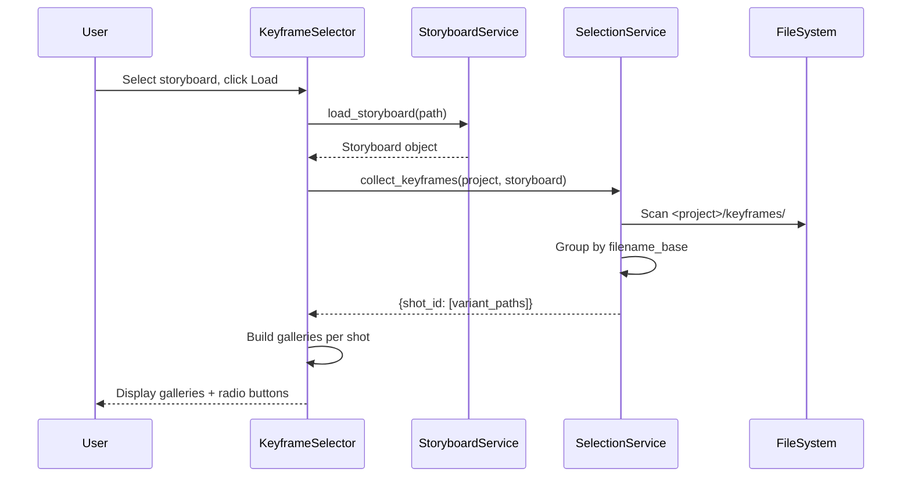

# ✅ Select (Keyframe Selector)

**Tab Name:** ✅ Select
**File:** `addons/keyframe_selector.py`
**Lines:** ~330
**Service:** SelectionService
**State:** Stateful (selections in gr.State)
**Shared Helpers:** `storyboard_section`, `storyboard_status_md`, `load_storyboard_from_config`, `selection_formatter` (Summary/Preview)

---

## Quick Reference

| Property | Value |
|----------|-------|
| **Purpose** | Select best keyframe variant per shot for video generation |
| **Main Files** | `addons/keyframe_selector.py`, `services/selection_service.py` |
| **Dependencies** | SelectionService, ProjectStore, StoryboardService, ConfigManager |
| **State Management** | Selections in gr.State, exported to `<project>/selected/selected_keyframes.json` |
| **Output Location** | `<project>/selected/*.png` + `selected_keyframes.json` |

---

## Functionality

The Keyframe Selector enables:

1. **Load Storyboard** - Load storyboard to get shot list (shared loader/helper)
2. **Collect Variants** - Find all keyframe variants per shot by `filename_base`
3. **Display Gallery** - Show variants grouped by shot with radio selection
4. **Select Best Variant** - User selects one variant per shot
5. **Export Selection** - Create JSON + copy selected PNGs to `selected/` directory

**Key Workflow:**
```
Load Storyboard
  → For each shot:
      → Find variants: <project>/keyframes/<filename_base>_v*_*.png
      → Display in gallery with radio buttons
  → User selects one variant per shot
  → Export → Creates selected_keyframes.json + copies PNGs
```

**Output Format:**
`<project>/selected/selected_keyframes.json`:
```json
{
  "project": "Project Name",
  "total_shots": 5,
  "exported_at": "2025-12-13T14:30:00",
  "selections": [
    {
      "shot_id": "001",
      "filename_base": "cathedral-interior",
      "selected_variant": 2,
      "selected_file": "cathedral-interior_v2_00001_.png",
      "source_path": "/path/to/keyframes/cathedral-interior_v2_00001_.png",
      "export_path": "/path/to/selected/cathedral-interior_v2_00001_.png"
    }
  ]
}
```

---

## Architecture

### UI Components

```python
# Setup Section
project_status = gr.Markdown()  # Active project display
storyboard_section = create_storyboard_section(...)  # Accordion + reload
storyboard_info_md = storyboard_section.info_md
load_storyboard_btn = storyboard_section.reload_btn

# Selection Summary
selection_summary = gr.Markdown()  # "Selected 3/5 shots"

# Shot Gallery (One per shot)
# Dynamically generated based on storyboard
shot_galleries = []  # List of gr.Gallery components
shot_radios = []  # List of gr.Radio components for variant selection

# Export Section
export_btn = gr.Button("💾 Export Selection")
export_status = gr.Markdown()  # Success/error message

# Internal State
selections_state = gr.State()  # Dict: {shot_id: {variant, file, ...}}
storyboard_state = gr.State()  # Loaded storyboard object
```

### Event Handlers

#### 1. `load_storyboard(storyboard_file) -> Tuple[...]`

**Purpose:** Load storyboard and collect keyframe variants

**Flow:**


**collect_keyframes() Logic:**
```python
def collect_keyframes(project, storyboard):
    keyframes_dir = project_path(project, "keyframes")
    variants = {}

    for shot in storyboard.shots:
        filename_base = shot.filename_base
        # Find all files matching: <filename_base>_v*_*.png
        pattern = f"{filename_base}_v*_*.png"
        files = glob(os.path.join(keyframes_dir, pattern))
        variants[shot.shot_id] = sorted(files)

    return variants
```

**Returns:**
- One gallery per shot (with variants)
- One radio button group per shot (for selection)
- Updated selection summary
- Storyboard stored in state

---

#### 2. `update_selection(shot_id, selected_variant) -> Tuple[Markdown, dict]`

**Purpose:** Update selection when user picks a variant

**Flow:**
```
User clicks radio button for variant
  → Extract variant number from selection
  → Update selections_state dict
  → Recalculate selection summary
  → Return updated summary + state
```

**State Format:**
```python
selections_state = {
    "001": {
        "selected_variant": 2,
        "selected_file": "cathedral-interior_v2_00001_.png",
        "source_path": "/full/path/to/keyframes/cathedral-interior_v2_00001_.png"
    },
    "002": {...},
}
```

**Returns:**
- Updated selection summary: "Selected 3/5 shots"
- Updated selections_state

---

#### 3. `export_selections() -> str`

**Purpose:** Create JSON and copy selected keyframes to `selected/` directory

**Delegation to Service:**
```python
def export_selections(self):
    project = self.project_store.get_active_project()
    storyboard = self.storyboard_state  # from gr.State
    selections = self.selections_state  # from gr.State

    # Delegate to service
    export_path, selection_data = self.selection_service.export_selections(
        project=project,
        storyboard=storyboard,
        selections=selections
    )

    return f"✅ Exported to {export_path}"
```

**Service Layer (SelectionService):**
See `services/SELECTION_SERVICE.md` for detailed service logic.

**High-Level Steps:**
1. Validate selections (all shots have selection?)
2. Create `<project>/selected/` directory if needed
3. Copy selected PNG files to `selected/` directory
4. Create `selected_keyframes.json` with metadata
5. Return export path and data

**Returns:**
- Success message with export path
- Error message if validation fails

---

### Service Integration

**SelectionService** (`services/selection/selection_service.py`)
- `collect_keyframes(project, storyboard)` - Find variant files
- `export_selections(project, storyboard, selections)` - Create JSON + copy files

---

## Dependencies

### Services

**SelectionService** (`services/selection/selection_service.py`)
- See `services/SELECTION_SERVICE.md` for details

### Infrastructure

**ProjectStore** (`infrastructure/project_store.py`)
- `get_active_project()` - Get project context
- `project_path(project, "keyframes")` - Get keyframes directory
- `project_path(project, "selected")` - Get selected directory
- `ensure_dir(project, "selected")` - Create directory

**ConfigManager** (`infrastructure/config_manager.py`)
- `get_current_storyboard()` - Default storyboard filename

### Domain

**StoryboardService** (`domain/storyboard_service.py`)
- `load_storyboard(path)` - Load storyboard

**Models** (`domain/models.py`)
- `Storyboard`, `Shot` dataclasses

---

## State Management

### Gradio State

**selections_state** (gr.State)
- Dict mapping shot_id to selected variant metadata
- Updated on each radio button change
- Used for export

**storyboard_state** (gr.State)
- Loaded storyboard object
- Used for export metadata

### Persistent State

**Selection Export** (`<project>/selected/selected_keyframes.json`)
- Created on export
- Contains all selection metadata
- Used by Video Generator

**Selected Images** (`<project>/selected/*.png`)
- Copies of selected keyframes
- Permanent storage

---

## Common Modifications

### Add "Select All First Variant" Button

**Example:** Quick-select first variant for all shots

**Steps:**
```python
select_all_first_btn = gr.Button("Quick Select: All First Variants")

def select_all_first_variants(storyboard, variants):
    selections = {}
    for shot in storyboard.shots:
        shot_id = shot.shot_id
        variant_files = variants.get(shot_id, [])
        if variant_files:
            selections[shot_id] = {
                "selected_variant": 1,
                "selected_file": os.path.basename(variant_files[0]),
                "source_path": variant_files[0]
            }
    return selections, f"Selected {len(selections)}/{len(storyboard.shots)} shots"

select_all_first_btn.click(
    fn=select_all_first_variants,
    inputs=[storyboard_state, variants_state],
    outputs=[selections_state, selection_summary]
)
```

---

### Add Comparison View

**Example:** Side-by-side comparison of variants

**Steps:**
1. Add comparison section:
   ```python
   with gr.Accordion("Compare Variants", open=False):
       compare_shot = gr.Dropdown(label="Select Shot to Compare")
       compare_gallery = gr.Gallery(columns=2, rows=1)

   def load_comparison(shot_id, variants):
       variant_paths = variants.get(shot_id, [])
       return variant_paths  # Gallery shows all variants

   compare_shot.change(
       fn=load_comparison,
       inputs=[compare_shot, variants_state],
       outputs=[compare_gallery]
   )
   ```

---

### Add Export Validation

**Example:** Warn if not all shots selected

**Steps:**
```python
def validate_export(storyboard, selections):
    total_shots = len(storyboard.shots)
    selected_count = len(selections)

    if selected_count == 0:
        return "❌ No selections made"
    elif selected_count < total_shots:
        return f"⚠️ Only {selected_count}/{total_shots} shots selected. Continue?"
    else:
        return "✅ All shots selected. Ready to export."

export_btn.click(
    fn=validate_export,
    inputs=[storyboard_state, selections_state],
    outputs=[export_status]
).then(
    fn=self.export_selections,
    # ... rest of export logic
)
```

---

## Key Files

### Primary Files
- **Addon:** `addons/keyframe_selector.py` (~300 lines)
- **Service:** `services/selection/selection_service.py` (96% coverage)
- **Tests:** `tests/unit/services/selection/test_selection_service.py`

### Related Files
- **Domain:** `domain/storyboard_service.py`
- **Infrastructure:** `infrastructure/project_store.py`

---

## Integration Points

### Dependencies (What This Addon Uses)
- **Keyframes** - Generated by Keyframe Generator
- **Storyboard** - Created by Storyboard Editor

### Dependents (What Uses This Addon)
- **Video Generator** - Uses `selected_keyframes.json` and selected images

### Shared State
- **Selection JSON** - Created here, consumed by Video Generator
- **Selected Images** - Created here, consumed by Video Generator

---

## Configuration

### Settings Used

**From `config/settings.json`:**
- `current_storyboard` - Default storyboard to load

---

## Testing Strategy

### Unit Tests

**Coverage:** 96% (SelectionService)

**Test File:** `tests/unit/services/selection/test_selection_service.py`

**Key Test Cases:**
- `test_collect_keyframes()` - Finds variants by filename_base
- `test_export_selections()` - Creates JSON and copies files
- `test_selection_validation()` - Handles missing selections
- `test_export_path_construction()` - Correct file paths

### Integration Tests

**Manual Testing Checklist:**
1. Generate keyframes (5 shots, 3 variants each)
2. Go to ✅ Select tab → Load storyboard
3. Verify galleries show 3 variants per shot
4. Select one variant per shot via radio buttons
5. Verify selection summary updates: "Selected 5/5 shots"
6. Click Export → Verify success message
7. Check `<project>/selected/` directory:
   - `selected_keyframes.json` exists
   - 5 PNG files (one per shot)
8. Open JSON → Verify structure matches specification
9. Go to 🎥 Video tab → Verify selection appears in dropdown

---

## Known Issues

None currently. This addon is stable.

---

## Related Documentation

- **Architecture:** `docs/README.md` - Selection export workflow
- **Services:** `docs/services/SELECTION_SERVICE.md`
- **User Guide:** `../README.md` - Selection instructions

---

**Last Updated:** December 21, 2025
**Version:** v0.6.1
