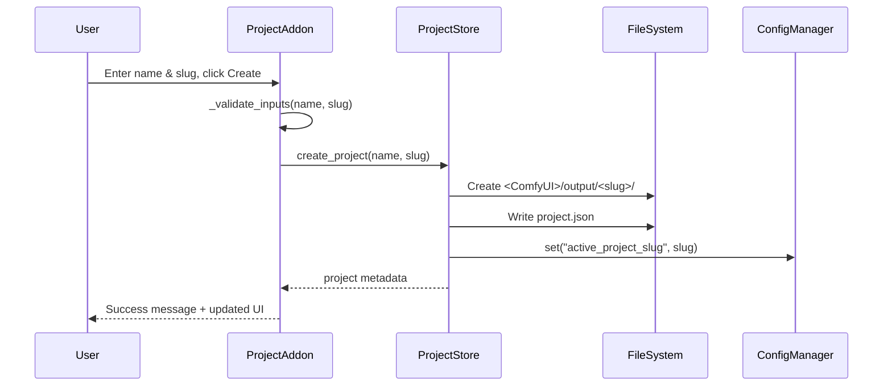

# 📁 Project Panel

**Tab Name:** 📁 Projekt
**File:** `addons/project_panel.py`
**Lines:** ~200
**Service:** None (direct ProjectStore usage)
**State:** Stateless

---

## Quick Reference

| Property | Value |
|----------|-------|
| **Purpose** | Create and manage project workspaces |
| **Main Files** | `addons/project_panel.py`, `infrastructure/project_store.py` |
| **Dependencies** | ProjectStore, ConfigManager |
| **State Management** | Active project stored in `config/settings.json` |
| **Output Location** | `<ComfyUI>/output/<project-slug>/` |

---

## Functionality

The Project Panel is the entry point for the CINDERGRACE pipeline. It allows users to:

1. **Create new projects** - Sets up directory structure and `project.json`
2. **Select existing projects** - Changes active project for all other tabs
3. **View project metadata** - Shows `project.json` content
4. **Manage project workspace** - Provides overview of project structure

**Key Concept:** All subsequent tabs (Storyboard, Keyframes, Selection, Video) operate within the context of the active project.

---

## Architecture

### UI Components

```python
# Status Bar
status_bar = gr.Markdown()  # Shows active project or "No project"

# ComfyUI Root Info
comfy_root_info = gr.Markdown()  # Shows configured ComfyUI path

# Project Overview
project_overview = gr.Markdown()  # Project name, slug, created date
project_json = gr.Code()  # JSON content viewer (accordion)

# Project Selection
project_dropdown = gr.Dropdown()  # List of existing projects
refresh_btn = gr.Button("↻")  # Refresh project list

# Project Creation
new_project_name = gr.Textbox()  # Input: project name
new_project_slug = gr.Textbox()  # Input: project slug (auto-generated or manual)
create_project_btn = gr.Button("Projekt erstellen")
```

### Event Handlers

#### 1. `create_project(name: str, slug: str) -> Tuple[str, Markdown, Markdown, Code, Dropdown]`

**Purpose:** Create new project directory and metadata

**Flow:**


**Validation:**
- Name cannot be empty
- Slug auto-generated from name if empty (lowercase, hyphens)
- Slug must be unique (checks existing directories)
- Uses `ProjectCreateInput` Pydantic validator

**Error Handling:**
- `@handle_errors("Projekt konnte nicht erstellt werden")`
- Returns error message in UI if validation fails
- Logs error with stack trace

**Returns:**
- Success message
- Updated status bar
- Updated project overview
- Updated project.json display
- Updated project dropdown (with new project)

---

#### 2. `select_project(slug: str) -> Tuple[str, Markdown, Markdown, Code]`

**Purpose:** Change active project

**Flow:**
```
User selects from dropdown
  → ProjectStore.set_active_project(slug)
  → ConfigManager.set("active_project_slug", slug)
  → Updates settings.json
  → Returns updated UI components
```

**Side Effects:**
- All other tabs now operate on the newly selected project
- Next tab switch will load data from new project directory

**Returns:**
- Success message
- Updated status bar
- Updated project overview
- Updated project.json display

---

#### 3. `refresh_projects() -> Tuple[Dropdown, Markdown]`

**Purpose:** Reload project list from filesystem

**Flow:**
```
User clicks refresh button
  → ProjectStore.list_projects()
  → Scans <ComfyUI>/output/ for directories with project.json
  → Returns updated dropdown choices
```

**Returns:**
- Updated project dropdown
- Updated status message

---

### Service Integration

**Direct ProjectStore Usage (No Service Layer):**

The Project Panel directly uses `ProjectStore` without an intermediate service layer. This is acceptable because:
- Operations are simple CRUD (Create, Read)
- No complex business logic
- No multi-step orchestration needed

**Future Enhancement (v0.7.0):**
Could extract to `ProjectService` for:
- Project status calculation (storyboard exists, keyframes complete, etc.)
- Project validation before operations
- Project export/import functionality

---

## Dependencies

### Infrastructure

**ProjectStore** (`infrastructure/project_store.py`)
- `create_project(name, slug)` - Create new project
- `get_active_project(refresh=bool)` - Get current active project
- `set_active_project(slug)` - Change active project
- `list_projects()` - List all projects in output directory
- `project_path(project, subdir=None)` - Get path to project or subdirectory

**ConfigManager** (`infrastructure/config_manager.py`)
- `get_comfy_root()` - Get ComfyUI installation path
- `set(key, value)` - Update settings.json
- `get(key, default)` - Read settings.json

### Domain

**Validators** (`domain/validators/domain_validators.py`)
- `ProjectCreateInput(name, slug)` - Validate project creation inputs

**Exceptions** (`domain/exceptions.py`)
- `ProjectError` - Base exception for project operations
- `ProjectNotFoundError` - Project does not exist

---

## State Management

### Active Project Storage

**Location:** `config/settings.json`

**Key:** `active_project_slug`

**Format:**
```json
{
  "active_project_slug": "my-project",
  "comfy_url": "http://127.0.0.1:8188",
  "comfy_root": "/path/to/ComfyUI"
}
```

**Access Pattern:**
```python
# Get active project
project = self.project_manager.get_active_project(refresh=True)

# Set active project
self.project_manager.set_active_project("new-slug")
```

### Project Metadata

**Location:** `<ComfyUI>/output/<slug>/project.json`

**Format:**
```json
{
  "name": "My Project",
  "slug": "my-project",
  "created_at": "2025-12-13T10:00:00",
  "path": "/path/to/ComfyUI/output/my-project",
  "storyboard": "storyboard_v1.json",
  "description": "Optional project description"
}
```

---

## Common Modifications

### Add New Project Field

**Example:** Add "author" field to project metadata

**Steps:**
1. Modify `infrastructure/project_store.py`:
   ```python
   def create_project(self, name: str, slug: str, author: str = "Unknown"):
       metadata = {
           "name": name,
           "slug": slug,
           "author": author,  # New field
           # ... existing fields
       }
   ```

2. Update `domain/validators/domain_validators.py`:
   ```python
   class ProjectCreateInput(BaseModel):
       name: str = Field(min_length=1)
       slug: str = Field(min_length=1)
       author: str = Field(default="Unknown")  # New field
   ```

3. Add UI input in `addons/project_panel.py`:
   ```python
   author_input = gr.Textbox(label="Author")

   create_project_btn.click(
       fn=self.create_project,
       inputs=[new_project_name, new_project_slug, author_input],
       # ...
   )
   ```

4. Update display in `_project_overview()`:
   ```python
   def _project_overview(self, project):
       return f"**Author:** {project.get('author', 'Unknown')}\n..."
   ```

---

### Add Project Status Indicator

**Example:** Show "🟢 Storyboard Ready | 🔴 No Keyframes" status

**Steps:**
1. Create status calculation method:
   ```python
   def _calculate_project_status(self, project):
       if not project:
           return {}

       status = {}

       # Check storyboard
       storyboard_dir = os.path.join(project["path"], "storyboards")
       status["storyboard"] = "🟢" if os.path.exists(storyboard_dir) and os.listdir(storyboard_dir) else "🔴"

       # Check keyframes
       keyframes_dir = os.path.join(project["path"], "keyframes")
       status["keyframes"] = "🟢" if os.path.exists(keyframes_dir) and os.listdir(keyframes_dir) else "🔴"

       return status
   ```

2. Add status display in `render()`:
   ```python
   status = self._calculate_project_status(project)
   gr.Markdown(f"{status.get('storyboard', '🔴')} Storyboard | {status.get('keyframes', '🔴')} Keyframes")
   ```

**Note:** This feature is planned for v0.6.0 (see `ROADMAP.md` - Status Badges)

---

### Validate ComfyUI Path Before Project Creation

**Example:** Check if ComfyUI path exists and is valid

**Steps:**
1. Add validation method:
   ```python
   def _is_comfy_path_valid(self) -> bool:
       comfy_root = self.config.get_comfy_root()
       if not comfy_root:
           return False
       return os.path.exists(comfy_root) and os.path.isdir(comfy_root)
   ```

2. Disable create button if invalid:
   ```python
   valid_path = self._is_comfy_path_valid()

   create_project_btn = gr.Button(
       "Projekt erstellen",
       interactive=valid_path
   )

   if not valid_path:
       warning_box = gr.Markdown(
           "⚠️ ComfyUI path not configured. Go to Settings tab.",
           visible=True
       )
   ```

---

## Key Files

### Primary Files
- **Addon:** `addons/project_panel.py` (~200 lines)
- **Infrastructure:** `infrastructure/project_store.py` (~300 lines)
- **Tests:** `tests/unit/infrastructure/test_project_store.py` (36 tests, 98% coverage)
- **Tests:** `tests/unit/test_addons_imports.py` (import smoke test)

### Related Files
- **Config:** `infrastructure/config_manager.py`
- **Validators:** `domain/validators/domain_validators.py`
- **Exceptions:** `domain/exceptions.py`

---

## Integration Points

### Dependencies (What This Addon Uses)
- **ConfigManager** - For ComfyUI root path and settings
- **ProjectStore** - For project CRUD operations

### Dependents (What Uses This Addon)
- **All other addons** - Rely on active project being set
- **Storyboard Editor** - Saves storyboards to active project
- **Keyframe Generator** - Saves keyframes to active project
- **Keyframe Selector** - Loads keyframes from active project
- **Video Generator** - Saves videos to active project

### Shared State
- **Active Project Slug** - Stored in `settings.json`, read by all addons

---

## Configuration

### Settings Used

**From `config/settings.json`:**
- `comfy_root` - Base path for ComfyUI installation
- `active_project_slug` - Currently active project slug

**From `project.json`:**
- `name` - Human-readable project name
- `slug` - URL-safe project identifier
- `created_at` - ISO 8601 timestamp
- `path` - Full path to project directory
- `storyboard` - Default storyboard filename (optional)
- `description` - Project description (optional)

---

## Testing Strategy

### Unit Tests

**Test File:** `tests/unit/infrastructure/test_project_store.py`

**Coverage:** 98% (36 tests passing)

**Key Test Cases:**
- `test_create_project()` - Project creation with valid inputs
- `test_create_project_duplicate_slug()` - Error on duplicate slug
- `test_get_active_project()` - Retrieve active project
- `test_set_active_project()` - Change active project
- `test_list_projects()` - List all projects
- `test_project_path()` - Path construction for subdirectories
- `test_file_locking()` - Concurrent access safety (Linux/Mac only)

### Integration Tests

**Manual Testing Checklist:**
1. Start GUI with no projects
2. Configure ComfyUI path in Settings
3. Create first project → Verify directory created
4. Create second project → Verify both listed
5. Switch between projects → Verify active project changes
6. Restart GUI → Verify active project persists
7. Go to Keyframe Generator → Verify project context displayed

---

## Known Issues

### Windows File Locking

**Issue:** `fcntl` not available on Windows for file locking

**Impact:** Potential race conditions in concurrent scenarios (rare)

**Workaround:** Atomic file operations (temp file + rename)

**Resolution:** See `BACKLOG.md` Issue #005 - Planned for v0.9.0

---

## Related Documentation

- **Architecture:** `docs/README.md` - Overall pipeline workflow
- **Infrastructure:** `docs/README.md` - ProjectStore details
- **ROADMAP:** `ROADMAP.md` - v0.6.0 Status Badges feature
- **BACKLOG:** `BACKLOG.md` - Issue #005 (Windows file locking)

---

**Last Updated:** December 13, 2025
**Version:** v0.5.1
