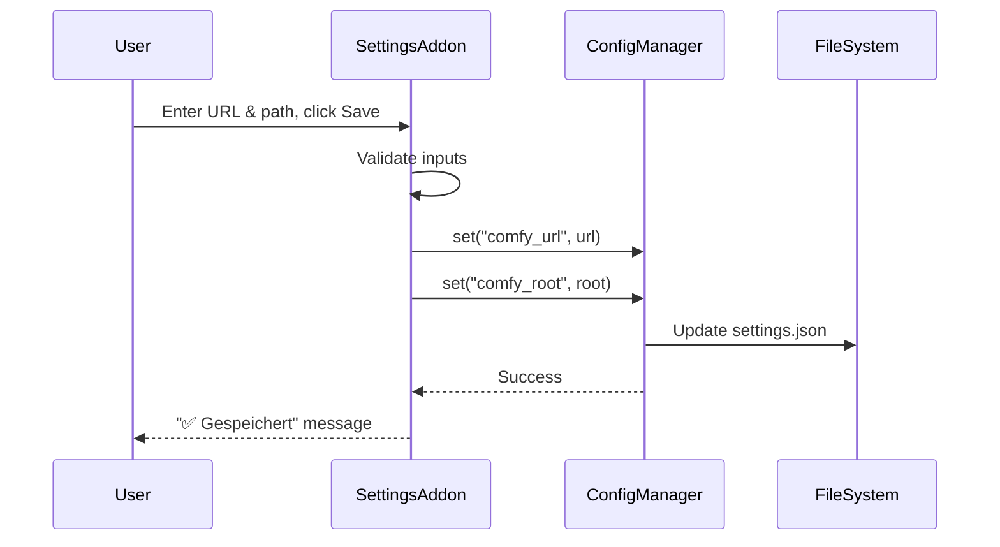

# ⚙️ Settings Panel

**Tab Name:** ⚙️ Settings
**File:** `addons/settings_panel.py`
**Lines:** ~150
**Service:** None (direct ConfigManager/WorkflowRegistry usage)
**State:** Stateless

---

## Quick Reference

| Property | Value |
|----------|-------|
| **Purpose** | Configure ComfyUI connection and workflow presets |
| **Main Files** | `addons/settings_panel.py`, `infrastructure/config_manager.py` |
| **Dependencies** | ConfigManager, WorkflowRegistry |
| **State Management** | All settings persisted to `config/settings.json` and `config/workflow_presets.json` |
| **Configuration Files** | `settings.json`, `workflow_presets.json` |

---

## Functionality

The Settings Panel provides configuration for:

1. **ComfyUI Connection**
   - Server URL (default: `http://127.0.0.1:8188`)
   - Installation root path (for model validation)

2. **Workflow Preset Management**
   - Edit `workflow_presets.json` which categorizes workflows for different tabs
   - Categories: `flux` (keyframe generation), `wan` (video generation)

3. **System Information**
   - Display current configuration
   - Show workflow template directory

**Key Concept:** Settings are global and affect all projects. Changes take effect immediately.

---

## Architecture

### UI Components

```python
# ComfyUI Configuration
comfy_url = gr.Textbox()  # ComfyUI server URL
comfy_root = gr.Textbox()  # ComfyUI installation path
save_settings_btn = gr.Button()  # Save settings
settings_message = gr.Markdown()  # Success/error feedback

# Workflow Presets
presets_editor = gr.Code()  # JSON editor for workflow_presets.json
save_presets_btn = gr.Button()  # Save presets
presets_message = gr.Markdown()  # Success/error feedback

# Information Display
current_settings = gr.Markdown()  # Shows current configuration
workflow_template_info = gr.Markdown()  # Shows workflow directory path
```

### Event Handlers

#### 1. `save_settings(comfy_url: str, comfy_root: str) -> str`

**Purpose:** Update ComfyUI connection configuration

**Flow:**


**Validation:**
- URL must start with `http://` or `https://`
- Root path must be a valid directory path
- If validation fails, returns error message without saving

**Error Handling:**
- Returns formatted error message on validation failure
- Logs error with stack trace
- Does not crash on invalid input

**Returns:**
- Success message: "✅ Einstellungen gespeichert"
- Error message: "❌ Fehler: [details]"

**Side Effects:**
- All addons using ConfigManager will see new values
- Next ComfyUI API call will use new URL
- Model validation will use new root path

---

#### 2. `save_presets(presets_json: str) -> str`

**Purpose:** Update workflow preset categorization

**Flow:**
```
User edits JSON in Code component, clicks Save
  → WorkflowRegistry.save_raw(presets_json)
  → Validates JSON syntax
  → Writes to config/workflow_presets.json
  → Returns success/error message
```

**Validation:**
- Must be valid JSON
- Should follow expected format (categories with file lists)
- Invalid JSON returns error without saving

**Expected Format:**
```json
{
  "flux": [
    "flux_test_simple.json",
    "flux_keyframe_1.json"
  ],
  "wan": [
    "Wan 2.2 14B i2v.json"
  ]
}
```

**Returns:**
- Success message from WorkflowRegistry
- Error message if JSON invalid

**Side Effects:**
- Workflow dropdowns in other tabs will show updated lists
- May require refresh of those tabs to see changes

---

#### 3. `load_current_settings() -> str`

**Purpose:** Display current configuration

**Flow:**
```
On tab load or refresh
  → ConfigManager.get("comfy_url")
  → ConfigManager.get("comfy_root")
  → Format as Markdown
  → Display in UI
```

**Returns:**
Markdown-formatted string:
```markdown
**ComfyUI URL:** http://127.0.0.1:8188
**ComfyUI Root:** /path/to/ComfyUI
**Active Project:** my-project
```

---

## Dependencies

### Infrastructure

**ConfigManager** (`infrastructure/config_manager.py`)
- `get(key, default)` - Read setting
- `set(key, value)` - Write setting
- `get_comfy_url()` - Helper for URL
- `get_comfy_root()` - Helper for root path

**WorkflowRegistry** (`infrastructure/workflow_registry.py`)
- `save_raw(content)` - Save workflow presets JSON
- `load_preset_config()` - Load current presets
- `list_presets(category)` - List workflows by category

---

## State Management

### Settings Storage

**Location:** `config/settings.json`

**Format:**
```json
{
  "comfy_url": "http://127.0.0.1:8188",
  "comfy_root": "/path/to/ComfyUI",
  "active_project_slug": "my-project",
  "default_resolution": "1024x576",
  "current_storyboard": "storyboard_v1.json"
}
```

**Access Pattern:**
```python
# Read
url = self.config.get("comfy_url", "http://127.0.0.1:8188")

# Write
self.config.set("comfy_url", "http://new-url:8188")
```

### Workflow Presets Storage

**Location:** `config/workflow_presets.json`

**Format:**
```json
{
  "flux": ["workflow1.json", "workflow2.json"],
  "wan": ["workflow3.json"]
}
```

**Usage:**
- Keyframe Generator uses `flux` category
- Video Generator uses `wan` category

---

## Common Modifications

### Add New Setting Field

**Example:** Add "max_queue_size" setting

**Steps:**
1. Add input in `render()`:
   ```python
   max_queue = gr.Number(
       value=self.config.get("max_queue_size", 10),
       label="Max Queue Size"
   )
   ```

2. Update `save_settings()` signature:
   ```python
   def save_settings(self, comfy_url, comfy_root, max_queue):
       self.config.set("comfy_url", comfy_url)
       self.config.set("comfy_root", comfy_root)
       self.config.set("max_queue_size", max_queue)
       return "✅ Gespeichert"
   ```

3. Wire event handler:
   ```python
   save_settings_btn.click(
       fn=self.save_settings,
       inputs=[comfy_url, comfy_root, max_queue],
       outputs=[settings_message]
   )
   ```

---

### Add New Workflow Category

**Example:** Add "audio" category for audio workflows

**Steps:**
1. Update preset file structure (manually or via UI):
   ```json
   {
     "flux": [...],
     "wan": [...],
     "audio": ["audio_workflow.json"]
   }
   ```

2. No code changes needed - WorkflowRegistry dynamically reads categories

3. Use in new addon:
   ```python
   audio_workflows = self.workflow_registry.get_files("audio")
   workflow_dropdown = gr.Dropdown(choices=audio_workflows)
   ```

---

### Add ComfyUI Connection Test

**Example:** Test connection when saving settings

**Steps:**
1. Import ComfyAPI:
   ```python
   from infrastructure.comfy_api import ComfyUIAPI
   ```

2. Modify `save_settings()`:
   ```python
   def save_settings(self, comfy_url, comfy_root):
       # Validate inputs
       if not comfy_url.startswith("http"):
           return "❌ Invalid URL"

       # Save settings
       self.config.set("comfy_url", comfy_url)
       self.config.set("comfy_root", comfy_root)

       # Test connection
       try:
           api = ComfyUIAPI(comfy_url)
           status = api.test_connection()
           if status.get("success"):
               return "✅ Gespeichert und verbunden"
           else:
               return "⚠️ Gespeichert, aber Verbindung fehlgeschlagen"
       except Exception as e:
           return f"⚠️ Gespeichert, aber Test fehlgeschlagen: {e}"
   ```

---

## Key Files

### Primary Files
- **Addon:** `addons/settings_panel.py` (~150 lines)
- **Infrastructure:** `infrastructure/config_manager.py` (~200 lines, 94% coverage)
- **Infrastructure:** `infrastructure/workflow_registry.py` (~150 lines, 100% coverage)
- **Tests:** `tests/unit/infrastructure/test_config_manager.py` (35 tests)
- **Tests:** `tests/unit/infrastructure/test_workflow_registry.py` (25 tests)
- **Tests:** `tests/unit/test_addons_helpers.py` (settings save/presets tests)

### Configuration Files
- `config/settings.json` - All GUI settings
- `config/workflow_presets.json` - Workflow categorization

---

## Integration Points

### Dependencies (What This Addon Uses)
- **ConfigManager** - Read/write settings
- **WorkflowRegistry** - Manage workflow presets

### Dependents (What Uses This Addon)
- **All addons** - Read settings via ConfigManager
- **ComfyAPI** - Uses `comfy_url` for connection
- **Model Validator** - Uses `comfy_root` for model checks
- **Keyframe/Video Generator** - Use workflow presets

### Shared State
- **ComfyUI URL** - Used by all ComfyAPI calls
- **ComfyUI Root** - Used for model validation
- **Workflow Presets** - Determines available workflows in dropdowns

---

## Configuration

### Default Settings

**Created on first run if `settings.json` doesn't exist:**
```json
{
  "comfy_url": "http://127.0.0.1:8188",
  "comfy_root": "",
  "default_resolution": "1024x576"
}
```

### Default Workflow Presets

**Created on first run if `workflow_presets.json` doesn't exist:**
```json
{
  "flux": [],
  "wan": []
}
```

---

## Testing Strategy

### Unit Tests

**Test Files:**
- `tests/unit/infrastructure/test_config_manager.py` (35 tests, 94% coverage)
- `tests/unit/infrastructure/test_workflow_registry.py` (25 tests, 100% coverage)
- `tests/unit/test_addons_helpers.py::test_settings_addon_save_settings`
- `tests/unit/test_addons_helpers.py::test_settings_addon_save_presets`

**Key Test Cases:**
- `test_save_settings()` - Valid inputs save correctly
- `test_save_settings_invalid_url()` - Error on invalid URL
- `test_save_presets()` - Valid JSON saves correctly
- `test_save_presets_invalid_json()` - Error on invalid JSON
- `test_load_preset_config()` - Presets loaded correctly
- `test_list_presets_by_category()` - Category filtering works

### Integration Tests

**Manual Testing Checklist:**
1. Open Settings tab → Verify current settings displayed
2. Update ComfyUI URL → Save → Verify saved in `settings.json`
3. Update ComfyUI Root → Save → Verify saved
4. Edit workflow presets → Save → Verify saved in `workflow_presets.json`
5. Enter invalid JSON → Save → Verify error message shown
6. Go to Keyframe Generator → Verify workflows from presets appear
7. Restart GUI → Verify settings persisted

---

## Known Issues

None currently. This addon is stable and well-tested.

---

## Related Documentation

- **Architecture:** `docs/README.md` - ConfigManager and WorkflowRegistry details
- **User Guide:** `../README.md` - Settings configuration instructions

---

**Last Updated:** December 13, 2025
**Version:** v0.5.1
