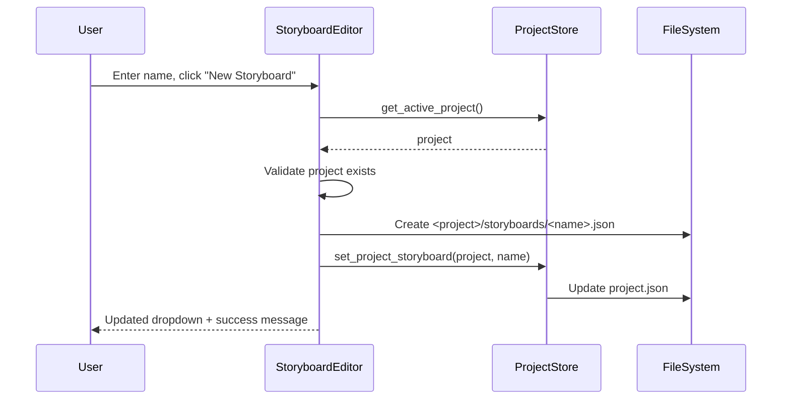

# 📝 Editor (Storyboard Editor)

**Tab Name:** 📝 Editor
**File:** `addons/storyboard_editor.py`
**Lines:** ~400 (estimated)
**Service:** StoryboardEditorService (if implemented) or direct StoryboardService usage
**State:** Stateful (current storyboard in gr.State)

---

## Quick Reference

| Property | Value |
|----------|-------|
| **Purpose** | Create and edit storyboards manually within the GUI |
| **Main Files** | `addons/storyboard_editor.py`, `domain/storyboard_service.py` |
| **Dependencies** | ProjectStore, StoryboardService, ConfigManager |
| **State Management** | Current storyboard held in Gradio state, saved to `<project>/storyboards/` |
| **Output Location** | `<project>/storyboards/*.json` |

---

## Functionality

The Storyboard Editor allows users to:

1. **Create new storyboards** within the active project
2. **Load existing storyboards** from project directory
3. **Edit shots** - Add, remove, reorder, duplicate shots
4. **Configure shot parameters:**
   - shot_id, filename_base, description
   - prompt, negative_prompt
   - width, height, duration
   - camera_movement
   - wan_motion (type, strength, notes)
5. **Save changes** to project-scoped JSON files
6. **Validate inputs** using Pydantic models
7. **Preview timeline** - Total duration, shot count

**Key Concept:** Storyboards are project-scoped and saved to `<project>/storyboards/`. Changes update `project.json` to reference the default storyboard.

---

## Architecture

### UI Components

```python
# Project Context
project_status = gr.Markdown()  # "Active Project: X (path)"

# Storyboard Management
storyboard_dropdown = gr.Dropdown()  # List of storyboards in project
refresh_storyboards_btn = gr.Button("🔄")
new_storyboard_btn = gr.Button("➕ New Storyboard")
save_storyboard_btn = gr.Button("💾 Save")
delete_storyboard_btn = gr.Button("🗑️ Delete")

# Shot List (Drag-to-Reorder)
shot_list = gr.Dataframe()  # Shows all shots with basic info
add_shot_btn = gr.Button("➕ Add Shot")

# Shot Editor (appears when editing a shot)
shot_id_input = gr.Textbox()
filename_base_input = gr.Textbox()
description_input = gr.Textbox()
prompt_input = gr.Textbox()
negative_prompt_input = gr.Textbox()
width_input = gr.Number()
height_input = gr.Number()
duration_input = gr.Number()
camera_movement_dropdown = gr.Dropdown()
wan_motion_type_dropdown = gr.Dropdown()
wan_motion_strength_slider = gr.Slider()
wan_motion_notes_input = gr.Textbox()
save_shot_btn = gr.Button("✅ Save Shot")
cancel_shot_btn = gr.Button("❌ Cancel")

# Timeline Summary
timeline_summary = gr.Markdown()  # "Total: 5 shots, 17.5s, 1024x576"

# Internal State
current_storyboard = gr.State()  # Holds storyboard dict
editing_shot_index = gr.State()  # Index of shot being edited (-1 = none)
```

### Event Handlers

#### 1. `create_new_storyboard(name: str) -> Tuple[str, List, Markdown]`

**Purpose:** Create new storyboard in active project

**Flow:**


**Validation:**
- Project must be active
- Storyboard name must not be empty
- Filename sanitized (lowercase, hyphens)
- Extension `.json` added automatically if missing

**Initial Storyboard Structure:**
```json
{
  "project": "Project Name",
  "shots": []
}
```

**Returns:**
- Success message
- Updated storyboard dropdown
- Empty timeline summary

---

#### 2. `load_storyboard(filename: str) -> Tuple[DataFrame, Markdown, dict]`

**Purpose:** Load existing storyboard from project

**Flow:**
```
User selects from dropdown
  → ProjectStore.get_project_storyboard_dir(project)
  → StoryboardService.load_storyboard(path)
  → Parse JSON → Storyboard object
  → Convert shots to DataFrame for display
  → Update timeline summary
  → Store in gr.State
```

**Returns:**
- Shot list DataFrame
- Timeline summary
- Storyboard dict (stored in state)

---

#### 3. `save_storyboard() -> str`

**Purpose:** Save current storyboard to file

**Flow:**
```
User clicks Save
  → Get current_storyboard from gr.State
  → Validate all shots
  → Write JSON to <project>/storyboards/<filename>
  → Update project.json (set as default storyboard)
  → Return success message
```

**Validation:**
- All shots must have unique shot_id
- Required fields must be present (prompt, width, height, duration)
- Numeric fields must be within bounds
- Uses Pydantic validators from `domain/validators/`

**Side Effects:**
- Updates `project.json` with `"storyboard": "<filename>"`
- Downstream tabs (Keyframe Generator) can now load this storyboard

**Returns:**
- Success: "✅ Storyboard gespeichert: <filename>"
- Error: "❌ Fehler: [validation details]"

---

#### 4. `add_shot() -> Tuple[DataFrame, dict]`

**Purpose:** Add new shot to current storyboard

**Flow:**
```
User clicks "Add Shot"
  → Get current_storyboard from gr.State
  → Generate next shot_id (e.g., "001", "002")
  → Create default shot dict
  → Append to shots list
  → Update gr.State
  → Refresh shot list DataFrame
```

**Default Shot:**
```json
{
  "shot_id": "001",
  "filename_base": "shot-001",
  "description": "",
  "prompt": "",
  "negative_prompt": "",
  "width": 1024,
  "height": 576,
  "duration": 3.0,
  "camera_movement": "static",
  "wan_motion": {
    "type": "none",
    "strength": 0.0,
    "notes": ""
  }
}
```

**Returns:**
- Updated shot list DataFrame
- Updated storyboard state

---

#### 5. `edit_shot(index: int) -> Tuple[...all shot fields...]`

**Purpose:** Load shot into editor form

**Flow:**
```
User clicks "✏️ Edit" on shot in list
  → Get current_storyboard from gr.State
  → Get shot at index
  → Populate all input fields with shot data
  → Set editing_shot_index to index
  → Make editor form visible
```

**Returns:**
- All shot field values (for populating inputs)
- Editor form visibility = True

---

#### 6. `save_shot(shot_id, filename_base, prompt, ...) -> Tuple[DataFrame, str, dict]`

**Purpose:** Save edited shot back to storyboard

**Flow:**
```
User edits fields, clicks "Save Shot"
  → Validate all inputs (Pydantic)
  → Get editing_shot_index from gr.State
  → Update shot at index in storyboard
  → Update gr.State
  → Refresh shot list DataFrame
  → Hide editor form
  → Return success message
```

**Validation:**
- shot_id must be unique within storyboard
- filename_base must be valid (alphanumeric, hyphens, underscores)
- width/height must be in valid range (e.g., 256-2048)
- duration must be > 0
- prompt cannot be empty

**Returns:**
- Updated shot list DataFrame
- Success/error message
- Updated storyboard state

---

#### 7. `delete_shot(index: int) -> Tuple[DataFrame, str, dict]`

**Purpose:** Remove shot from storyboard

**Flow:**
```
User clicks "🗑️ Delete" on shot
  → Show confirmation dialog
  → Get current_storyboard from gr.State
  → Remove shot at index
  → Update gr.State
  → Refresh shot list DataFrame
```

**Returns:**
- Updated shot list DataFrame
- Success message
- Updated storyboard state

---

#### 8. `duplicate_shot(index: int) -> Tuple[DataFrame, dict]`

**Purpose:** Create copy of shot with incremented ID

**Flow:**
```
User clicks "📋 Duplicate" on shot
  → Get shot at index
  → Deep copy shot dict
  → Increment shot_id (e.g., "001" → "002")
  → Increment filename_base (e.g., "cathedral" → "cathedral-2")
  → Append to shots list
  → Update gr.State
```

**Returns:**
- Updated shot list DataFrame
- Updated storyboard state

---

### Service Integration

**StoryboardService** (`domain/storyboard_service.py`)
- `load_storyboard(path)` - Load JSON and parse to Storyboard object
- May need to add `save_storyboard(path, storyboard)` method

**ProjectStore Extensions** (to be added)
- `get_project_storyboard_dir(project)` - Get `<project>/storyboards/` path
- `ensure_storyboard_dir(project)` - Create directory if not exists
- `set_project_storyboard(project, filename)` - Update `project.json`
- `list_project_storyboards(project)` - List `.json` files in storyboards dir

---

## Dependencies

### Infrastructure

**ProjectStore** (`infrastructure/project_store.py`)
- `get_active_project()` - Get current project
- `get_project_storyboard_dir(project)` - NEW: Get storyboards directory
- `ensure_storyboard_dir(project)` - NEW: Ensure directory exists
- `set_project_storyboard(project, filename)` - NEW: Update project.json
- `list_project_storyboards(project)` - NEW: List storyboard files

**ConfigManager** (`infrastructure/config_manager.py`)
- `get("active_project_slug")` - Get active project slug

### Domain

**StoryboardService** (`domain/storyboard_service.py`)
- `load_storyboard(path)` - Load and parse storyboard JSON
- `save_storyboard(path, storyboard)` - NEW: Save storyboard to JSON (if not present)

**Models** (`domain/models.py`)
- `Storyboard` - Dataclass for storyboard
- `Shot` - Dataclass for individual shot

**Validators** (`domain/validators/domain_validators.py`)
- May need `StoryboardValidator`, `ShotValidator` (to be added)

---

## State Management

### Gradio State

**current_storyboard** (gr.State)
- Holds full storyboard dict while editing
- Updated on every shot add/edit/delete
- Persisted to file on save

**editing_shot_index** (gr.State)
- Index of shot currently being edited
- -1 when no shot is being edited
- Used to determine which shot to update on save

### File System

**Storage Location:** `<project>/storyboards/<filename>.json`

**Project Reference:** `<project>/project.json` updated with:
```json
{
  "storyboard": "storyboard_v1.json"
}
```

---

## Common Modifications

### Add New Shot Field

**Example:** Add "scene_number" field to shots

**Steps:**
1. Update `domain/models.py`:
   ```python
   @dataclass
   class Shot:
       # ... existing fields
       scene_number: Optional[int] = None
   ```

2. Add UI input in storyboard_editor.py:
   ```python
   scene_number_input = gr.Number(label="Scene Number", value=1)
   ```

3. Add to save_shot signature:
   ```python
   def save_shot(self, shot_id, filename_base, ..., scene_number):
       shot_dict = {
           "shot_id": shot_id,
           # ... existing fields
           "scene_number": scene_number,
       }
   ```

4. Add to edit_shot return:
   ```python
   return (shot.scene_number or 1, ...)  # Populate input
   ```

5. Update default shot in add_shot():
   ```python
   default_shot = {
       # ... existing fields
       "scene_number": 1,
   }
   ```

---

### Add Shot Reordering (Drag-and-Drop)

**Example:** Allow drag-and-drop to reorder shots

**Challenge:** Gradio doesn't natively support drag-and-drop for DataFrames

**Solution Options:**

**Option A: Up/Down Buttons**
```python
def move_shot_up(index):
    if index > 0:
        storyboard["shots"][index], storyboard["shots"][index-1] = \
            storyboard["shots"][index-1], storyboard["shots"][index]
    return updated_dataframe, storyboard

up_btn.click(fn=move_shot_up, inputs=[shot_index], outputs=[shot_list, current_storyboard])
```

**Option B: Number Input for Position**
```python
new_position_input = gr.Number(label="Move to Position")

def reorder_shot(index, new_position):
    shot = storyboard["shots"].pop(index)
    storyboard["shots"].insert(new_position, shot)
    return updated_dataframe, storyboard
```

---

### Add Storyboard Templates

**Example:** Quick-start templates (Music Video, Product Showcase, etc.)

**Steps:**
1. Create templates in `config/storyboard_templates/`:
   ```json
   // music_video_template.json
   {
     "project": "Template",
     "shots": [
       {"shot_id": "001", "duration": 3.0, "prompt": "Opening shot..."},
       {"shot_id": "002", "duration": 3.0, "prompt": "Artist closeup..."},
       // ... 10 shots total
     ]
   }
   ```

2. Add template selector in UI:
   ```python
   template_dropdown = gr.Dropdown(
       choices=["None", "Music Video", "Product Showcase"],
       label="Load Template"
   )

   def load_template(template_name):
       if template_name == "None":
           return empty_storyboard
       template_path = f"config/storyboard_templates/{template_name.lower().replace(' ', '_')}.json"
       return load_json(template_path)
   ```

---

## Key Files

### Primary Files
- **Addon:** `addons/storyboard_editor.py` (~400 lines, estimated)
- **Domain:** `domain/storyboard_service.py` (~200 lines)
- **Domain:** `domain/models.py` (Shot, Storyboard dataclasses)
- **Tests:** `tests/unit/test_storyboard_editor.py` (to be created)

### Related Files
- **Infrastructure:** `infrastructure/project_store.py` (extensions needed)
- **Validators:** `domain/validators/domain_validators.py` (shot validation)

---

## Integration Points

### Dependencies (What This Addon Uses)
- **ProjectStore** - Get active project, manage storyboard directories
- **StoryboardService** - Load/save storyboards
- **ConfigManager** - Get active project slug

### Dependents (What Uses This Addon)
- **Keyframe Generator** - Loads storyboards created here
- **Keyframe Selector** - Uses shot metadata
- **Video Generator** - Uses shot metadata for video generation

### Shared State
- **Storyboard Files** - Created here, consumed by downstream tabs
- **Project.json Reference** - `"storyboard"` field set by this addon

---

## Configuration

### No direct configuration needed

Storyboards are self-contained JSON files. The addon adapts to the active project.

---

## Testing Strategy

### Unit Tests (To Be Created)

**Test File:** `tests/unit/test_storyboard_editor.py`

**Coverage Target:** 85%+

**Key Test Cases:**
- `test_create_new_storyboard()` - Creates file in project directory
- `test_load_storyboard()` - Loads existing storyboard
- `test_save_storyboard()` - Writes to file and updates project.json
- `test_add_shot()` - Adds shot with defaults
- `test_edit_shot()` - Updates existing shot
- `test_delete_shot()` - Removes shot from list
- `test_duplicate_shot()` - Creates copy with incremented ID
- `test_save_shot_validation()` - Rejects invalid inputs
- `test_unique_shot_id()` - Prevents duplicate shot_ids
- `test_no_active_project()` - Shows error when no project selected

### Integration Tests

**Manual Testing Checklist:**
1. Create project in Project tab
2. Go to Storyboard Editor
3. Click "New Storyboard" → Enter name → Verify created
4. Add 3 shots → Fill in details → Save each
5. Save storyboard → Verify file in `<project>/storyboards/`
6. Go to Keyframe Generator → Verify storyboard appears in dropdown
7. Return to Storyboard Editor → Load storyboard → Verify shots loaded
8. Edit shot → Change prompt → Save → Reload → Verify change persisted
9. Delete shot → Save → Reload → Verify shot removed
10. Duplicate shot → Verify copy created with incremented ID

---

## Known Issues

### To Be Discovered

This is a new addon (v0.6.0). Issues will be tracked in `BACKLOG.md` as they are found.

---

## Related Documentation

- **Architecture:** `docs/README.md` - Overall pipeline workflow
- **ROADMAP:** `ROADMAP.md` - v0.6.0 Storyboard Editor feature details
- **Domain:** Shot and Storyboard model definitions
- **User Guide:** `../README.md` - Storyboard format specification

---

**Last Updated:** December 13, 2025
**Version:** v0.6.0 (Planned)
