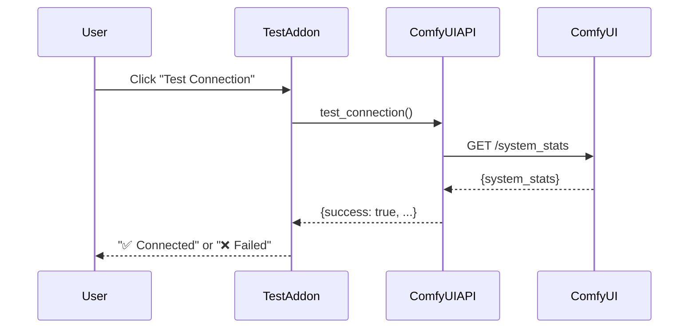

# 🧪 Test (ComfyUI Connection Test)

**Tab Name:** 🧪 Test
**File:** `addons/test_comfy_flux.py`
**Lines:** ~110
**Category:** `tools` (grouped under Tools tab)
**Service:** None (direct ComfyAPI usage)
**State:** Stateless

---

## Quick Reference

| Property | Value |
|----------|-------|
| **Purpose** | Test connection to ComfyUI and keyframe test image generation |
| **Location** | Tools → 🧪 Test ComfyUI (sub-tab) |
| **Main Files** | `addons/test_comfy_flux.py`, `infrastructure/comfy_api/comfy_api_client.py` |
| **Dependencies** | ComfyUIAPI, ConfigManager, WorkflowRegistry |
| **Output Location** | ComfyUI `/output/` directory |
| **Use Case** | Debugging, connection verification, keyframe generation tests |

---

## Functionality

The Test ComfyUI addon provides:

1. **Connection Testing** (Accordion)
   - Verify ComfyUI server is reachable
   - Check `/system_stats` endpoint
   - Display connection status (✅/🔴)
   - Show system information (optional nested accordion)

2. **Keyframe Test Generation** (Accordion)
   - Test image generation with any workflow (Flux, SDXL, etc.)
   - Configurable parameters (prompt, images, seed, workflow)
   - Multiple image generation (1-10 images with seed incrementing)
   - Real-time generation progress
   - Gallery display of generated images

3. **Status Display** (Always Visible)
   - Current operation status
   - Success/error messages
   - Clear, actionable feedback

**Key Concept:** This is a developer/debugging tool for testing ComfyUI connectivity and image generation workflows. It's model-agnostic (works with Flux, SDXL, or any image generation workflow).

**UI Pattern:** All sections use collapsible Accordions (default: closed) for a clean, organized interface.

---

## Architecture

### UI Structure (Accordion-Based)

```
# 🔌 ComfyUI Connection & Keyframe Test

[Status: Ready - Click 'Generate Test Images' to start]  ← Always visible

▶ 🔌 Connection Test (Accordion, closed)
  ├── ComfyUI URL (Textbox)
  ├── Test Connection (Button)
  ├── Connection Status (Markdown)
  └── ▶ System Info (Nested Accordion, closed)
      └── System Stats (JSON)

▶ 🎨 Keyframe Test Generation & Results (Accordion, closed)
  ├── Prompt (Textbox, 3 lines)
  ├── Number of Images (Slider, 1-10)
  ├── Starting Seed (Number)
  ├── Workflow Template (Dropdown)
  ├── Refresh Workflows (Button)
  ├── Generate Test Images (Button, primary)
  ├── --- (Separator)
  ├── Generated Images (Heading)
  ├── Image Gallery (Gallery, 4 columns)
  └── Clear Gallery (Button)
```

### UI Components (Code)

```python
# Status (always visible)
status_text = gr.Markdown("**Ready** - Click 'Generate Test Images' to start")

# Connection Test Accordion
with gr.Accordion("🔌 Connection Test", open=False):
    comfy_url = gr.Textbox(value=config.get_comfy_url(), label="ComfyUI URL")
    test_conn_btn = gr.Button("🔌 Test Connection")
    connection_status = gr.Markdown("**Status:** 🔴 Not tested")

    with gr.Accordion("System Info", open=False):
        system_info = gr.JSON(label="ComfyUI System Stats")

# Generation Accordion
with gr.Accordion("🎨 Keyframe Test Generation & Results", open=False):
    prompt = gr.Textbox(label="Prompt", lines=3)
    num_images = gr.Slider(1, 10, 4, label="Number of Images")
    start_seed = gr.Number(value=1001, label="Starting Seed")
    workflow_dropdown = gr.Dropdown(label="Workflow Template")
    generate_btn = gr.Button("🎨 Generate Test Images", variant="primary")

    gr.Markdown("---")
    image_gallery = gr.Gallery(columns=4)
    clear_btn = gr.Button("🗑️ Clear Gallery")
```

### Event Handlers

#### 1. `test_connection() -> str`

**Purpose:** Verify ComfyUI server is running and accessible

**Flow:**


**Returns:**
- Success: "✅ Verbunden mit ComfyUI\nServer: http://127.0.0.1:8188"
- Failure: "❌ Verbindung fehlgeschlagen: [error details]"

**Error Handling:**
- Catches connection errors (timeout, refused)
- Catches HTTP errors (404, 500)
- Returns user-friendly error messages

---

#### 2. `generate_test_images(comfy_url, prompt, num_images, start_seed, workflow_file) -> Tuple[List, str]`

**Purpose:** Generate multiple keyframe test images with configurable parameters

**Flow:**
```
User enters prompt, configures settings, clicks Generate
  → ComfyAPI.load_workflow(workflow_file)
  → For each image (1 to num_images):
      → seed = start_seed + i
      → ComfyAPI.update_workflow_params(workflow, prompt=prompt, seed=seed, filename_prefix=f"test_{seed}")
      → ComfyAPI.queue_prompt(workflow)
      → ComfyAPI.monitor_progress(prompt_id)
      → Generated images stay in ComfyUI output/
      → Add to results
  → Display all images in gallery
  → Return status
```

**Parameters:**
- `comfy_url` - ComfyUI server URL (from settings or manual entry)
- `prompt` - Text prompt for image generation
- `num_images` - Number of images to generate (1-10)
- `start_seed` - Starting seed value (increments for each image)
- `workflow_file` - Workflow template filename (from `config/workflow_templates/`)

**Returns:**
- Gallery images: List of image paths from ComfyUI output
- Status message: Success ("✅ Success! Generated X images") or error details

**Output:**
Images generated in ComfyUI `/output/` directory with filename prefix `test_[seed]_*.png`

**Note:** Images remain in ComfyUI's standard output directory for easy access and debugging. This is model-agnostic (works with Flux, SDXL, SD3, or any image generation workflow).

---

## Dependencies

### Infrastructure

**ComfyUIAPI** (`infrastructure/comfy_api/comfy_api_client.py`)
- `test_connection()` - Test server connectivity
- `load_workflow(path)` - Load workflow JSON
- `update_workflow_params(workflow, **params)` - Inject parameters
- `queue_prompt(workflow)` - Submit job to ComfyUI
- `monitor_progress(prompt_id, callback)` - Watch WebSocket progress
- `get_output_images(prompt_id)` - Download generated images

**ConfigManager** (`infrastructure/config_manager.py`)
- `get_comfy_url()` - Get ComfyUI server URL

**WorkflowRegistry** (`infrastructure/workflow_registry.py`)
- `get_files("flux")` - List available Flux workflows for testing

---

## State Management

**Stateless:** This addon does not persist any state. Each test is independent.

**Output Location:** `output/test/` (not project-scoped)

---

## Common Modifications

### Add More Test Scenarios

**Example:** Add a test for Wan video generation

**Steps:**
1. Add new test section in `render()`:
   ```python
   gr.Markdown("### Wan Video Test")
   wan_test_prompt = gr.Textbox(label="Video Prompt")
   wan_workflow_dropdown = gr.Dropdown(
       choices=self.workflow_registry.get_files("wan"),
       label="Wan Workflow"
   )
   wan_test_btn = gr.Button("Generate Test Video")
   wan_output = gr.Video()
   ```

2. Add event handler:
   ```python
   def generate_test_video(self, prompt, workflow_file):
       # Similar to generate_test_image but for video
       pass

   wan_test_btn.click(
       fn=self.generate_test_video,
       inputs=[wan_test_prompt, wan_workflow_dropdown],
       outputs=[wan_output, test_message]
   )
   ```

---

### Add System Diagnostics

**Example:** Show ComfyUI system stats (VRAM, models loaded, etc.)

**Steps:**
1. Create diagnostics method:
   ```python
   def get_system_diagnostics(self):
       try:
           api = ComfyUIAPI(self.config.get_comfy_url())
           stats = api.test_connection()

           return f"""
           **System Stats:**
           - VRAM: {stats.get('vram', 'Unknown')}
           - Models Loaded: {stats.get('models', 'Unknown')}
           - Queue Size: {stats.get('queue', 0)}
           """
       except Exception as e:
           return f"❌ Could not fetch diagnostics: {e}"
   ```

2. Add to UI:
   ```python
   diagnostics_btn = gr.Button("Show Diagnostics")
   diagnostics_output = gr.Markdown()

   diagnostics_btn.click(
       fn=self.get_system_diagnostics,
       outputs=[diagnostics_output]
   )
   ```

---

### Add Workflow Validation Test

**Example:** Test that workflow file is valid JSON and has required nodes

**Steps:**
1. Create validation method:
   ```python
   def validate_workflow(self, workflow_file):
       try:
           api = ComfyUIAPI(self.config.get_comfy_url())
           workflow = api.load_workflow(workflow_file)

           # Check for required nodes
           required_nodes = ["CLIPTextEncode", "KSampler", "SaveImage"]
           found_nodes = set()

           for node_id, node in workflow.items():
               if node.get("class_type") in required_nodes:
                   found_nodes.add(node.get("class_type"))

           missing = set(required_nodes) - found_nodes

           if missing:
               return f"⚠️ Missing nodes: {', '.join(missing)}"
           else:
               return f"✅ Workflow valid ({len(workflow)} nodes)"

       except Exception as e:
           return f"❌ Validation failed: {e}"
   ```

2. Add to UI with validate button

---

## Key Files

### Primary Files
- **Addon:** `addons/test_comfy_flux.py` (~100 lines)
- **Infrastructure:** `infrastructure/comfy_api/comfy_api_client.py` (~600 lines, 100% coverage)
- **Tests:** `tests/unit/infrastructure/comfy_api/test_comfy_api_client.py` (comprehensive tests)

### Output Directory
- `output/test/` - Test images stored here (not in project directories)

---

## Integration Points

### Dependencies (What This Addon Uses)
- **ComfyUIAPI** - All ComfyUI operations
- **ConfigManager** - Get ComfyUI URL
- **WorkflowRegistry** - List available workflows

### Dependents (What Uses This Addon)
- None (standalone debugging tool)

### Shared State
- None (stateless)

---

## Configuration

### Settings Used

**From `config/settings.json`:**
- `comfy_url` - ComfyUI server URL

**From `config/workflow_presets.json`:**
- `flux` - List of Flux workflows for testing

---

## Testing Strategy

### Unit Tests

**Test File:** `tests/unit/infrastructure/comfy_api/test_comfy_api_client.py`

**Coverage:** 100% (ComfyAPI client fully tested)

**Key Test Cases:**
- `test_connection_success()` - Connection test succeeds
- `test_connection_failure()` - Handles connection errors
- `test_load_workflow()` - Loads JSON workflow
- `test_queue_prompt()` - Queues job to ComfyUI
- `test_monitor_progress()` - WebSocket monitoring
- `test_get_output_images()` - Downloads images

### Integration Tests

**Manual Testing Checklist:**
1. Start ComfyUI server
2. Open Test ComfyUI tab → Click "Test Connection"
3. Verify "✅ Connected" message
4. Enter test prompt → Select workflow → Generate
5. Verify image appears in gallery
6. Check `output/test/` directory for saved image
7. Stop ComfyUI server → Test Connection → Verify error message

**Troubleshooting Test:**
- If connection fails, check ComfyUI URL in Settings
- If generation fails, check ComfyUI console for errors
- If no images appear, check `output/test/` directory manually

---

## Known Issues

None currently. This addon is stable and used regularly for debugging.

---

## UI Design Notes

### Accordion Pattern

The Test ComfyUI tool uses collapsible accordions for a clean, organized interface:

```
Status Line (Always Visible)
  ↓
Accordions (All closed by default)
  ├── Connection Test
  └── Keyframe Test Generation & Results
```

**Benefits:**
- Clean initial view (only status visible)
- User expands only what they need
- Reduces scrolling
- Consistent with other tools (Model Manager)
- Mobile-friendly

**User Flow:**
1. Open Tools → Test ComfyUI
2. See status line
3. Expand "Connection Test" → Test connection
4. Expand "Keyframe Test Generation" → Configure → Generate
5. Scroll within same accordion to see results

---

## Tool Category

This addon uses `category="tools"` in BaseAddon initialization:

```python
super().__init__(
    name="ComfyUI Test",
    description="Test ComfyUI connection and generate keyframe test images",
    category="tools"  # Makes it appear under Tools tab
)
```

This automatically groups it under the "🔧 Tools" tab as a sub-tab.

---

## Related Documentation

- **Tools Overview:** [TOOLS.md](TOOLS.md) - All tools documentation
- **Architecture:** `docs/README.md` - ComfyAPI section
- **Infrastructure:** ComfyAPI client documentation (in README.md)
- **User Guide:** `../README.md` - Troubleshooting section

---

**Last Updated:** December 13, 2025
**Version:** v0.6.0
**Status:** ✅ Stable
