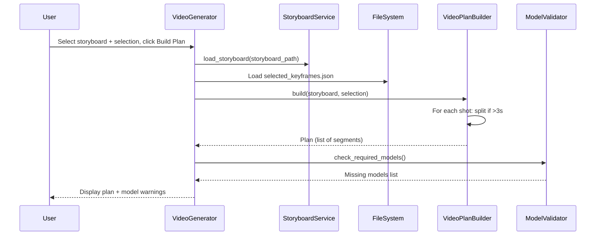

# 🎥 Video Generator

**Tab Name:** 🎥 Video Generator
**File:** `addons/video_generator.py`
**Lines:** 373 (after Sprint 2 refactoring, down from 960)
**Services:** VideoGenerationService, VideoPlanBuilder, LastFrameExtractor
**State:** Stateful (UI state persisted to `<project>/video/_state.json`)

---

## Quick Reference

| Property | Value |
|----------|-------|
| **Purpose** | Generate video clips from selected keyframes using Wan 2.2 (HunyuanVideo) |
| **Main Files** | `addons/video_generator.py`, `services/video/video_generation_service.py`, `services/video/video_plan_builder.py` |
| **Dependencies** | VideoGenerationService, VideoPlanBuilder, LastFrameExtractor, ProjectStore, ModelValidator, StateStore |
| **State Management** | UI state in `<project>/video/_state.json`, persists across refresh |
| **Output Location** | `<project>/video/shot_<id>_seg_<N>.mp4`, LastFrames in `_startframes/` |

---

## Functionality

The Video Generator enables:

1. **Load Storyboard + Selection** - Load storyboard and selected keyframes JSON
2. **Build Generation Plan** - Split shots >3s into 3-second segments with LastFrame chaining
3. **Validate Models** - Check if required Wan models are present in ComfyUI
4. **Generate Videos** - For each segment:
   - Inject startframe, prompt, duration into Wan workflow
   - Queue to ComfyUI
   - Monitor progress via WebSocket
   - Extract LastFrame if needed for next segment
   - Copy video to `<project>/video/`
5. **Play Videos** - Display last generated clip in video player
6. **State Persistence** - UI state survives browser refresh

**Key Workflow:**
```
Load Storyboard + Selection
  → VideoPlanBuilder.build(storyboard, selection)
  → For each shot:
      → If duration ≤3s: Single segment
      → If duration >3s: Split into 3s segments, chain via LastFrame
  → For each segment:
      → Inject startframe (selected keyframe or LastFrame)
      → Inject prompt, duration, resolution into Wan workflow
      → Queue to ComfyUI
      → Monitor progress → Download video
      → Extract LastFrame if more segments follow
  → Copy all videos to <project>/video/
```

**LastFrame Chaining Example:**
```
Shot 001 (duration: 5 seconds)
  → Segment 0: Startframe = selected_keyframes/shot_001.png → 3s video
      → Extract LastFrame → _startframes/shot_001_lastframe_0.png
  → Segment 1: Startframe = _startframes/shot_001_lastframe_0.png → 2s video
      (Note: 2s is trimmed from 3s Wan output, see BACKLOG.md #004)
```

---

## Architecture

### UI Components

```python
# Setup Section
project_status = gr.Markdown()  # Active project + path
storyboard_dropdown = gr.Dropdown()  # Storyboards from project
selection_dropdown = gr.Dropdown()  # Selections from project/selected/
refresh_storyboard_btn = gr.Button("↻")
refresh_selection_btn = gr.Button("↻")
workflow_dropdown = gr.Dropdown()  # Wan workflows
refresh_workflow_btn = gr.Button("↻")

# Plan Section
build_plan_btn = gr.Button("🗓️ Build Plan")
plan_display = gr.JSON()  # Show generation plan (segments)
model_check_display = gr.Markdown()  # Missing models warning

# Generation Section
start_generation_btn = gr.Button("▶️ Start Generation")
status_display = gr.Markdown()  # Current status
progress_details = gr.Markdown()  # Detailed progress per segment

# Video Player Section
video_player = gr.Video()  # Display last generated clip
video_status = gr.Markdown()  # "Playing: shot_003_seg_1.mp4"

# State Persistence
state_store = VideoGeneratorStateStore()  # Persists to _state.json
```

### Event Handlers

#### 1. `build_plan(storyboard_file, selection_file) -> Tuple[JSON, Markdown]`

**Purpose:** Create generation plan with segmentation for shots >3s

**Flow:**


**VideoPlanBuilder Logic:**
```python
def build(storyboard, selection, max_segment_seconds=3.0):
    plan = []
    for shot in storyboard.shots:
        selected_keyframe = selection[shot.shot_id]["export_path"]
        segments = split_into_segments(shot, max_segment_seconds)

        for i, segment in enumerate(segments):
            if i == 0:
                startframe = selected_keyframe  # First segment uses selected keyframe
            else:
                startframe = f"_startframes/{shot.shot_id}_lastframe_{i-1}.png"

            plan.append({
                "shot_id": shot.shot_id,
                "segment_index": i,
                "startframe": startframe,
                "prompt": shot.prompt,
                "duration": segment.duration,
                "width": shot.width,
                "height": shot.height,
                "output_file": f"shot_{shot.shot_id}_seg_{i}.mp4"
            })

    return plan
```

**Returns:**
- Plan JSON (list of segments)
- Model check markdown (warnings if models missing)

---

#### 2. `start_generation(storyboard_file, selection_file, workflow_file) -> Generator[Tuple]`

**Purpose:** Execute generation plan

**Delegation to Service:**
```python
def start_generation(self, storyboard_file, selection_file, workflow_file):
    # Load data
    storyboard = StoryboardService.load_storyboard(storyboard_path)
    selection = load_json(selection_path)

    # Delegate to service
    for update in self.video_service.run_generation(
        storyboard=storyboard,
        selection=selection,
        workflow_path=workflow_file,
        plan=self.plan  # From build_plan step
    ):
        # update is a tuple: (status_md, progress_md, video_path, state_dict)
        yield update

        # Update persistent state
        self.state_store.update(**update[3])
```

**Service Layer (VideoGenerationService):**
See `services/VIDEO_SERVICE.md` for detailed service logic.

**High-Level Steps:**
1. For each segment in plan:
   - Load Wan workflow template
   - Inject startframe path into LoadImage node
   - Inject prompt into CLIPTextEncode node
   - Inject duration (num_frames = duration × fps) into HunyuanVideoSampler
   - Inject resolution into EmptyLatentImage
   - Queue to ComfyUI
   - Monitor progress via WebSocket
   - Download video to `<project>/video/`
   - If more segments follow for this shot:
     - Extract LastFrame using ffmpeg
     - Save to `<project>/video/_startframes/`
   - Yield progress update

**Yields (Progressive Updates):**
```python
(
    status_markdown,      # "Generating shot 3/5, segment 2/2"
    progress_details_md,  # "Prompt: cathedral interior, Duration: 2s"
    video_path,          # Path to last completed video
    state_dict           # UI state for persistence
)
```

---

#### 3. `load_last_video() -> Video`

**Purpose:** Load last generated video on tab switch or refresh

**Flow:**
```
Tab loads
  → StateStore.load()
  → Get last_video_path from state
  → Return video path for player
```

**State Persistence:**
```json
{
  "storyboard_file": "storyboard_v1.json",
  "selection_file": "selected_keyframes.json",
  "workflow_file": "Wan 2.2 14B i2v.json",
  "last_video_path": "/path/to/shot_005_seg_0.mp4",
  "updated_at": "2025-12-13T14:30:00"
}
```

**Saved To:** `<project>/video/_state.json`

**Benefits:**
- UI survives browser refresh
- Last selections remembered
- Last video visible after restart

---

### Service Integration

**VideoGenerationService** (`services/video/video_generation_service.py`)
- `run_generation(storyboard, selection, workflow_path, plan)` - Main orchestration
- Returns generator yielding progress updates

**VideoPlanBuilder** (`services/video/video_plan_builder.py`)
- `build(storyboard, selection, max_segment_seconds=3.0)` - Create generation plan
- `split_into_segments(shot, max_seconds)` - Segment shots >3s

**LastFrameExtractor** (`services/video/last_frame_extractor.py`)
- `extract_last_frame(video_path, output_path)` - ffmpeg extraction
- Used for chaining segments

**ModelValidator** (`infrastructure/model_validator.py`)
- `check_required_models()` - Verify Wan models present

---

## Dependencies

### Services

**VideoGenerationService** (`services/video/video_generation_service.py`)
- See `services/VIDEO_SERVICE.md` for details

**VideoPlanBuilder** (`services/video/video_plan_builder.py`)
- Plan building and segmentation logic

**LastFrameExtractor** (`services/video/last_frame_extractor.py`)
- ffmpeg wrapper for frame extraction

### Infrastructure

**ProjectStore** (`infrastructure/project_store.py`)
- `get_active_project()` - Get project context
- `project_path(project, "video")` - Get video directory
- `ensure_dir(project, "video")` - Create directory

**ModelValidator** (`infrastructure/model_validator.py`)
- `check_required_models()` - Check Wan models
- Uses `comfy_root` from settings

**VideoGeneratorStateStore** (`infrastructure/state_store.py`)
- `configure(state_file_path)` - Set state file location
- `update(**fields)` - Update state
- `load()` - Load state on tab load
- `clear()` - Reset state

**ComfyUIAPI** (used by services)
- See `docs/README.md` - ComfyAPI section

### Domain

**StoryboardService** (`domain/storyboard_service.py`)
- `load_storyboard(path)` - Load storyboard

**Models** (`domain/models.py`)
- `Storyboard`, `Shot` dataclasses

**Validators** (`domain/validators/domain_validators.py`)
- `VideoGenerationInputs` - Validates storyboard, selection, workflow paths

---

## State Management

### UI State Persistence

**StateStore** (`infrastructure/state_store.py`)
- Location: `<project>/video/_state.json`
- Persisted fields:
  - `storyboard_file`
  - `selection_file`
  - `workflow_file`
  - `last_video_path`
  - `updated_at`

**On Tab Load:**
```python
state = self.state_store.load()
storyboard_dropdown.value = state.get("storyboard_file")
selection_dropdown.value = state.get("selection_file")
workflow_dropdown.value = state.get("workflow_file")
video_player.value = state.get("last_video_path")
```

**On User Action:**
```python
self.state_store.update(
    storyboard_file="storyboard_v1.json",
    last_video_path="/path/to/video.mp4"
)
```

### Generated Artifacts

**Videos** (`<project>/video/shot_<id>_seg_<N>.mp4`)
- Permanent storage
- Naming format includes shot ID and segment index

**LastFrames** (`<project>/video/_startframes/<shot_id>_lastframe_<seg>.png`)
- Cached frames for segment chaining
- Reused if regeneration needed

---

## Common Modifications

### Add Video Concatenation

**Example:** Automatically concatenate all segments into final video

**Steps:**
See ROADMAP.md v0.7.0 - Timeline Export feature for concatenation planning.

---

### Add Wan Motion Parameters from Storyboard

**Example:** Use `wan_motion` from storyboard

**Steps:**
See ROADMAP.md v0.7.0 - Enhanced Wan Motion Control feature.

---

### Add Progress Bar

**Example:** Real-time progress bar

**Steps:**
See BACKLOG.md Issue #003 for implementation plan.

---

## Key Files

### Primary Files
- **Addon:** `addons/video_generator.py` (373 lines)
- **Service:** `services/video/video_generation_service.py` (100% coverage)
- **Service:** `services/video/video_plan_builder.py` (100% coverage)
- **Service:** `services/video/last_frame_extractor.py` (100% coverage)
- **Tests:** `tests/unit/services/video/test_video_generation_service.py`
- **Tests:** `tests/unit/services/video/test_video_plan_builder.py`
- **Tests:** `tests/unit/services/video/test_last_frame_extractor.py`

### Related Files
- **Infrastructure:** `infrastructure/model_validator.py`
- **Infrastructure:** `infrastructure/state_store.py`
- **Infrastructure:** `infrastructure/comfy_api/comfy_api_client.py`

---

## Integration Points

### Dependencies (What This Addon Uses)
- **Storyboard** - Created by Storyboard Editor
- **Selection** - Created by Keyframe Selector
- **Wan Workflows** - Configured in Settings

### Dependents (What Uses This Addon)
- None (final output of pipeline)

### Shared State
- **Video Files** - Output of pipeline, used by user externally

---

## Configuration

### Settings Used

**From `config/settings.json`:**
- `comfy_url` - ComfyUI server URL
- `comfy_root` - For model validation

**From `config/workflow_presets.json`:**
- `wan` - List of Wan workflows for dropdown

---

## Testing Strategy

### Unit Tests

**Coverage:** 100% (VideoGenerationService), 100% (VideoPlanBuilder), 100% (LastFrameExtractor)

**Test Files:**
- `tests/unit/services/video/test_video_generation_service.py`
- `tests/unit/services/video/test_video_plan_builder.py`
- `tests/unit/services/video/test_last_frame_extractor.py`

**Key Test Cases:**
- Plan building with segmentation
- LastFrame extraction success/failure
- Video generation orchestration
- State persistence

### Integration Tests

**Manual Testing Checklist:**
1. Complete keyframe generation + selection
2. Go to Video Generator
3. Load storyboard + selection → Build Plan
4. Verify plan shows segments (shot >3s split)
5. Verify model check shows no missing models
6. Start generation → Monitor progress
7. Verify videos appear in `<project>/video/`
8. Verify LastFrames in `_startframes/` if segmented
9. Verify last video plays in video player
10. Refresh browser → Verify state restored

---

## Known Issues

### Medium Priority

**#004: Shots >3s Extended (BACKLOG.md)**
- Videos padded to multiples of 3 seconds
- Example: 5s shot → 6s output (2×3s segments)
- **Workaround:** Trim in post-production
- **Target:** v0.7.0

---

## Related Documentation

- **Architecture:** `docs/README.md` - Video generation workflow
- **Services:** `docs/services/VIDEO_SERVICE.md`
- **ROADMAP:** `ROADMAP.md` - v0.7.0 planned enhancements
- **BACKLOG:** `BACKLOG.md` - Issue #004
- **User Guide:** `../README.md` - Video generation instructions

---

**Last Updated:** December 13, 2025
**Version:** v0.5.1
