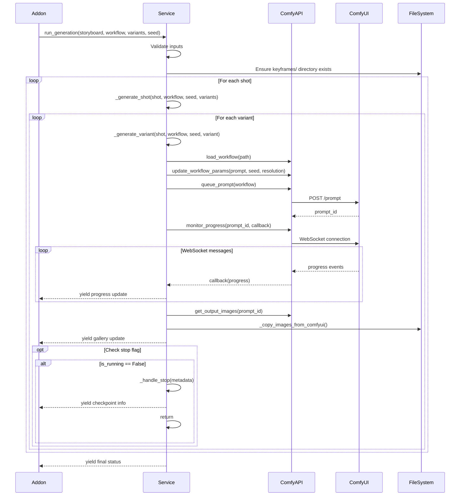

# Keyframe Services

**Files:**
- `services/keyframe_service.py` (~600 lines, 89% coverage)

**Purpose:** Encapsulates all business logic for keyframe generation, including ComfyUI interaction, file management, and checkpoint/resume functionality.

---

## Overview

The Keyframe Service layer separates the business logic of keyframe generation from the UI layer (Keyframe Generator addon). It consists of a single comprehensive service that handles:

1. **Generation Orchestration** - Multi-shot, multi-variant generation workflow
2. **ComfyUI Integration** - Workflow updates, queueing, progress monitoring
3. **File Management** - Copying images from ComfyUI output to project directories
4. **Checkpoint/Resume** - Save generation state for pause/resume
5. **Error Handling** - Graceful failure with detailed logging

---

## KeyframeService

**Location:** `services/keyframe_service.py`

**Coverage:** 89% (428 tests passing)

---

### Class Structure

```python
class KeyframeService:
    def __init__(self, project_store, config, workflow_registry):
        self.project_store = project_store
        self.config = config
        self.workflow_registry = workflow_registry
        self.is_running = False  # Stop flag

    # Main generation method (generator)
    def run_generation(self, storyboard, workflow_path, num_variants, base_seed) -> Generator

    # Checkpoint management
    def prepare_checkpoint(self, metadata) -> dict
    def load_checkpoint(self, checkpoint_id) -> dict

    # Helper methods
    def _generate_shot(self, shot, workflow, base_seed, variants, project)
    def _generate_variant(self, shot, workflow, seed, variant_num, project)
    def _copy_images_from_comfyui(self, prompt_id, target_dir, filename_prefix)
    def _handle_stop(self, metadata) -> dict
```

---

### Main Methods

#### `run_generation(storyboard, workflow_path, num_variants, base_seed) -> Generator`

**Purpose:** Orchestrate generation for all shots and variants

**Parameters:**
- `storyboard` (Storyboard) - Loaded storyboard object
- `workflow_path` (str) - Path to Flux workflow JSON
- `num_variants` (int) - Number of variants per shot (1-10)
- `base_seed` (int) - Starting seed (0-2147483647)

**Returns:** Generator yielding progress tuples

**Workflow:**


**Yields:**
Progressive updates as tuples:
```python
(
    status_markdown,        # "Generating shot 3/5, variant 2/4"
    progress_details_md,   # "Prompt: cathedral interior, Seed: 2001"
    gallery_images,        # List[str] - paths to generated images
    current_shot_display,  # "Shot 003: cathedral-interior"
    checkpoint_json        # dict - checkpoint metadata
)
```

**Error Handling:**
- Catches ComfyUI connection errors → yields error message
- Catches file I/O errors → logs and continues
- Catches workflow update errors → yields error and skips variant
- Uses `@handle_errors` decorator for top-level exception handling

**Stop Handling:**
- Checks `self.is_running` flag each iteration
- If False → calls `_handle_stop()` → saves checkpoint → returns

---

#### `_generate_shot(shot, workflow, base_seed, variants, project)`

**Purpose:** Generate all variants for a single shot

**Parameters:**
- `shot` (Shot) - Shot object from storyboard
- `workflow` (dict) - Loaded workflow JSON
- `base_seed` (int) - Base seed for this shot
- `variants` (int) - Number of variants
- `project` (dict) - Project metadata

**Workflow:**
1. For variant_num in range(1, variants+1):
   - Calculate seed = base_seed + variant_num - 1
   - Call `_generate_variant(shot, workflow, seed, variant_num, project)`
   - Yield progress after each variant

**Stop Detection:**
- Checks `self.is_running` before each variant
- If stopped → breaks loop → returns

---

#### `_generate_variant(shot, workflow, seed, variant_num, project)`

**Purpose:** Generate a single keyframe variant

**Parameters:**
- `shot` (Shot) - Shot object
- `workflow` (dict) - Workflow JSON
- `seed` (int) - Seed for this variant
- `variant_num` (int) - Variant number (1-N)
- `project` (dict) - Project metadata

**Workflow:**
1. Update workflow parameters:
   ```python
   api = ComfyUIAPI(self.config.get_comfy_url())
   updated_workflow = api.update_workflow_params(
       workflow,
       prompt=shot.prompt,
       negative_prompt=shot.negative_prompt,
       seed=seed,
       width=shot.width,
       height=shot.height,
       filename_prefix=f"{shot.filename_base}_v{variant_num}"
   )
   ```

2. Queue to ComfyUI:
   ```python
   prompt_id = api.queue_prompt(updated_workflow)
   ```

3. Monitor progress:
   ```python
   api.monitor_progress(prompt_id, callback=progress_callback)
   ```

4. Copy images:
   ```python
   keyframes_dir = self.project_store.ensure_dir(project, "keyframes")
   self._copy_images_from_comfyui(prompt_id, keyframes_dir, f"{shot.filename_base}_v{variant_num}")
   ```

**Returns:** None (yields via parent generator)

**Error Handling:**
- If queue fails → logs error, yields error message
- If copy fails → logs warning, continues (images may be in ComfyUI output)

---

#### `_copy_images_from_comfyui(prompt_id, target_dir, filename_prefix)`

**Purpose:** Copy generated images from ComfyUI output to project directory

**Parameters:**
- `prompt_id` (str) - ComfyUI prompt ID
- `target_dir` (str) - Destination directory
- `filename_prefix` (str) - Expected filename prefix

**Workflow:**
1. Get ComfyUI output directory from config
2. Find files matching `<filename_prefix>_*.png` in ComfyUI output
3. Copy each file to target_dir
4. Log successful copies

**File Naming:**
ComfyUI generates files like: `cathedral-interior_v2_00001_.png`
- Matches prefix: `cathedral-interior_v2`
- Sequence number: `00001`
- Trailing underscore: `_` (ComfyUI convention)

**Returns:** Number of files copied

**Error Handling:**
- Logs warning if no files found
- Logs error if copy fails
- Does not raise (allows generation to continue)

---

#### `prepare_checkpoint(metadata) -> dict`

**Purpose:** Create checkpoint for resume

**Parameters:**
- `metadata` (dict) - Checkpoint metadata including:
  - `storyboard_file`
  - `workflow_file`
  - `num_variants`
  - `base_seed`
  - `completed_shots` (list of shot_ids)
  - `current_shot` (shot_id)
  - `current_variant` (int)

**Workflow:**
1. Generate checkpoint ID: `ckpt_YYYYMMDD_HHMMSS`
2. Add timestamp and checkpoint_id to metadata
3. Write to `<project>/checkpoints/<checkpoint_id>.json`
4. Return checkpoint dict

**Checkpoint Format:**
```json
{
  "checkpoint_id": "ckpt_20251213_143000",
  "created_at": "2025-12-13T14:30:00",
  "storyboard_file": "storyboard_v1.json",
  "workflow_file": "flux_keyframe_1.json",
  "num_variants": 4,
  "base_seed": 2000,
  "completed_shots": ["001", "002"],
  "current_shot": "003",
  "current_variant": 2
}
```

**Returns:** Checkpoint dict

**Error Handling:**
- Raises exception if checkpoint directory cannot be created
- Logs error if JSON write fails

---

#### `load_checkpoint(checkpoint_id) -> dict`

**Purpose:** Load checkpoint for resume

**Parameters:**
- `checkpoint_id` (str) - Checkpoint ID (e.g., "ckpt_20251213_143000")

**Workflow:**
1. Construct path: `<project>/checkpoints/<checkpoint_id>.json`
2. Read and parse JSON
3. Return checkpoint dict

**Returns:** Checkpoint dict

**Error Handling:**
- Raises FileNotFoundError if checkpoint not found
- Raises JSONDecodeError if invalid JSON

---

#### `_handle_stop(metadata) -> dict`

**Purpose:** Handle graceful stop during generation

**Parameters:**
- `metadata` (dict) - Current generation state

**Workflow:**
1. Call `prepare_checkpoint(metadata)`
2. Log stop event
3. Return checkpoint dict for UI display

**Returns:** Checkpoint dict

---

### Stop Flag

**Property:** `self.is_running` (bool)

**Usage:**
```python
# Start generation
service.is_running = True

# In generation loop
if not service.is_running:
    checkpoint = service._handle_stop(metadata)
    yield checkpoint_update
    return

# Stop button handler
service.is_running = False
```

**Thread Safety:** Not thread-safe (single-threaded Gradio execution model)

---

## Testing Strategy

### Unit Tests

**Test File:** `tests/unit/services/keyframe/test_keyframe_service.py`

**Coverage:** 89%

**Key Test Cases:**
- `test_run_generation_success()` - Full generation workflow
- `test_run_generation_with_stop()` - Stop flag handling
- `test_generate_shot()` - Shot-level iteration
- `test_generate_variant()` - Variant-level generation
- `test_copy_images_from_comfyui()` - File copying logic
- `test_prepare_checkpoint()` - Checkpoint creation
- `test_load_checkpoint()` - Checkpoint loading
- `test_handle_stop()` - Graceful shutdown

### Integration Tests

**Manual Testing:**
1. Generate 5 shots × 3 variants = 15 keyframes
2. Monitor progress updates in UI
3. Stop mid-generation → Verify checkpoint saved
4. Verify images in `<project>/keyframes/`
5. Verify filenames match storyboard `filename_base`

---

## Common Modifications

### Add Custom Progress Callback

**Example:** Custom progress reporting

**Steps:**
```python
def run_generation(self, storyboard, workflow_path, num_variants, base_seed, progress_callback=None):
    for shot in storyboard.shots:
        # ...
        if progress_callback:
            progress_callback(shot_id=shot.shot_id, variant=variant_num, progress=percent)
        # ...
```

---

### Add Variant Naming Customization

**Example:** Allow custom filename patterns

**Steps:**
```python
def _generate_variant(self, shot, workflow, seed, variant_num, project, filename_pattern=None):
    if filename_pattern:
        prefix = filename_pattern.format(
            shot_id=shot.shot_id,
            filename_base=shot.filename_base,
            variant=variant_num
        )
    else:
        prefix = f"{shot.filename_base}_v{variant_num}"
    # ... rest of method
```

---

## Related Documentation

- **Addon:** `docs/addons/KEYFRAME_GENERATOR.md`
- **Architecture:** `docs/README.md` - Service layer section
- **Infrastructure:** ComfyAPI documentation in README.md
- **Tests:** `tests/unit/services/keyframe/`

---

**Last Updated:** December 13, 2025
**Version:** v0.5.1
