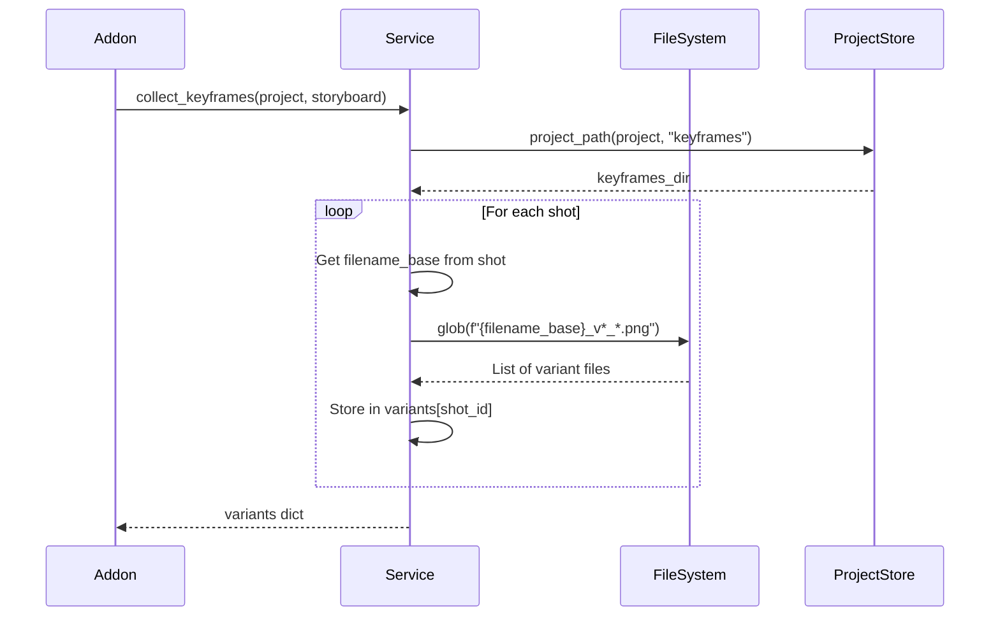
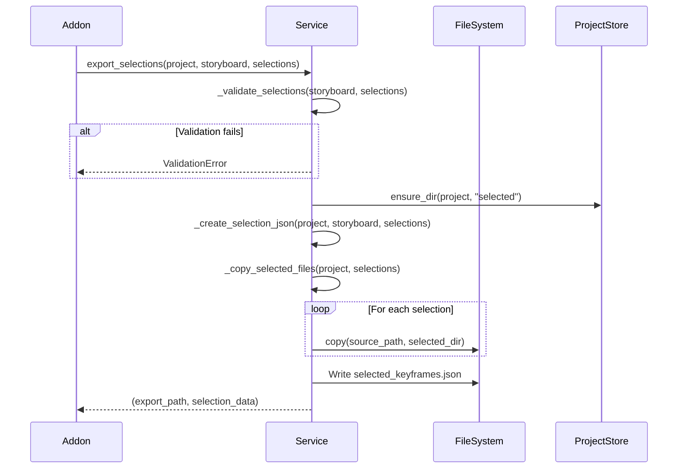

# Selection Service

**File:** `services/selection_service.py` (~150 lines, 96% coverage)

**Purpose:** Handle keyframe selection export, including file collection, JSON generation, and file copying.

---

## Overview

The Selection Service encapsulates the business logic for:

1. **Variant Collection** - Find all keyframe variants per shot by filename_base
2. **Selection Validation** - Ensure selections are complete and valid
3. **Export Generation** - Create `selected_keyframes.json` with metadata
4. **File Copying** - Copy selected PNGs to `selected/` directory

---

## SelectionService

**Location:** `services/selection_service.py`

**Coverage:** 96% (17+ tests passing)

---

### Class Structure

```python
class SelectionService:
    def __init__(self, project_store):
        self.project_store = project_store

    # Main methods
    def collect_keyframes(self, project, storyboard) -> dict
    def export_selections(self, project, storyboard, selections) -> Tuple[str, dict]

    # Helper methods
    def _validate_selections(self, storyboard, selections) -> List[str]
    def _create_selection_json(self, project, storyboard, selections) -> dict
    def _copy_selected_files(self, project, selections) -> int
```

---

### Main Methods

#### `collect_keyframes(project, storyboard) -> dict`

**Purpose:** Find all keyframe variants per shot

**Parameters:**
- `project` (dict) - Project metadata
- `storyboard` (Storyboard) - Loaded storyboard object

**Returns:** Dict mapping shot_id to list of variant file paths

**Workflow:**


**Example Return Value:**
```python
{
    "001": [
        "/path/to/keyframes/cathedral-interior_v1_00001_.png",
        "/path/to/keyframes/cathedral-interior_v2_00001_.png",
        "/path/to/keyframes/cathedral-interior_v3_00001_.png"
    ],
    "002": [
        "/path/to/keyframes/character-closeup_v1_00001_.png",
        "/path/to/keyframes/character-closeup_v2_00001_.png"
    ]
}
```

**File Matching Pattern:**
- Pattern: `<filename_base>_v*_*.png`
- Matches: `cathedral-interior_v2_00001_.png`
- Groups by filename_base from storyboard

**Error Handling:**
- Returns empty list for shot if no variants found
- Logs warning if keyframes directory doesn't exist
- Does not raise (allows UI to show "No variants" message)

---

#### `export_selections(project, storyboard, selections) -> Tuple[str, dict]`

**Purpose:** Create selection JSON and copy selected files

**Parameters:**
- `project` (dict) - Project metadata
- `storyboard` (Storyboard) - Storyboard object
- `selections` (dict) - User selections mapping shot_id to variant metadata

**Returns:** Tuple of (export_path, selection_data)

**Workflow:**


**Selection Input Format:**
```python
selections = {
    "001": {
        "selected_variant": 2,
        "selected_file": "cathedral-interior_v2_00001_.png",
        "source_path": "/path/to/keyframes/cathedral-interior_v2_00001_.png"
    },
    "002": {...}
}
```

**Selection Output Format:**
```json
{
  "project": "Project Name",
  "total_shots": 5,
  "exported_at": "2025-12-13T14:30:00",
  "selections": [
    {
      "shot_id": "001",
      "filename_base": "cathedral-interior",
      "selected_variant": 2,
      "selected_file": "cathedral-interior_v2_00001_.png",
      "source_path": "/path/to/keyframes/cathedral-interior_v2_00001_.png",
      "export_path": "/path/to/selected/cathedral-interior_v2_00001_.png"
    }
  ]
}
```

**Returns:**
- `export_path` (str) - Path to `selected_keyframes.json`
- `selection_data` (dict) - Complete selection JSON

**Error Handling:**
- Raises ValidationError if selections incomplete
- Raises IOError if file copy fails
- Raises JSONDecodeError if JSON write fails
- Uses `@handle_errors` decorator

---

#### `_validate_selections(storyboard, selections) -> List[str]`

**Purpose:** Validate that all shots have selections

**Parameters:**
- `storyboard` (Storyboard) - Storyboard object
- `selections` (dict) - User selections

**Returns:** List of error messages (empty if valid)

**Validation Rules:**
1. All shots must have a selection
2. Each selection must have `selected_variant`, `selected_file`, `source_path`
3. Source file must exist

**Example Errors:**
```python
[
    "Shot 001: No selection made",
    "Shot 003: Missing source_path",
    "Shot 005: Source file not found: /path/to/file.png"
]
```

**Returns:** List of error strings (empty list if valid)

---

#### `_create_selection_json(project, storyboard, selections) -> dict`

**Purpose:** Build selection JSON structure

**Parameters:**
- `project` (dict) - Project metadata
- `storyboard` (Storyboard) - Storyboard object
- `selections` (dict) - User selections

**Workflow:**
1. Create base structure with project name, timestamp
2. For each shot in storyboard:
   - Get selection from selections dict
   - Get shot metadata (filename_base)
   - Build selection entry
3. Return complete JSON

**Returns:** Selection JSON dict

---

#### `_copy_selected_files(project, selections) -> int`

**Purpose:** Copy selected PNGs to `selected/` directory

**Parameters:**
- `project` (dict) - Project metadata
- `selections` (dict) - User selections

**Workflow:**
1. Ensure `<project>/selected/` directory exists
2. For each selection:
   - Copy `source_path` → `<project>/selected/<filename>`
   - Update `export_path` in selection metadata
3. Return count of files copied

**Returns:** Number of files copied

**Error Handling:**
- Logs error if copy fails
- Continues with remaining files
- Raises if selected directory cannot be created

---

## Testing Strategy

### Unit Tests

**Test File:** `tests/unit/services/selection/test_selection_service.py`

**Coverage:** 96% (17+ tests passing)

**Key Test Cases:**
- `test_collect_keyframes()` - Variant collection by filename_base
- `test_collect_keyframes_no_variants()` - Handles missing variants
- `test_export_selections()` - Full export workflow
- `test_export_selections_incomplete()` - Validation error handling
- `test_validate_selections()` - All validation rules
- `test_create_selection_json()` - JSON structure
- `test_copy_selected_files()` - File copying logic

### Integration Tests

**Manual Testing:**
1. Generate keyframes (5 shots, 3 variants each)
2. Go to Keyframe Selector → Load storyboard
3. Verify variants collected correctly (15 total images)
4. Select one variant per shot
5. Export → Verify success
6. Check `<project>/selected/`:
   - `selected_keyframes.json` exists
   - 5 PNG files present
7. Verify JSON structure matches specification
8. Verify Video Generator can load selection

---

## Common Modifications

### Add Selection Summary Statistics

**Example:** Add statistics to selection JSON

**Steps:**
```python
def _create_selection_json(self, project, storyboard, selections):
    # ... existing code

    selection_json["statistics"] = {
        "total_variants_available": sum(len(variants) for variants in all_variants.values()),
        "most_common_variant": self._calculate_most_common_variant(selections),
        "average_variant": self._calculate_average_variant(selections)
    }

    return selection_json
```

---

### Add Batch Export

**Example:** Export multiple selection sets

**Steps:**
```python
def export_multiple_selections(self, project, storyboard, selection_sets):
    results = []
    for name, selections in selection_sets.items():
        export_path, data = self.export_selections(
            project,
            storyboard,
            selections,
            output_filename=f"selected_keyframes_{name}.json"
        )
        results.append((name, export_path))
    return results
```

---

### Add Selection Diff

**Example:** Compare two selections

**Steps:**
```python
def diff_selections(self, selection1, selection2):
    differences = []
    for shot_id in selection1.keys():
        if selection1[shot_id]["selected_variant"] != selection2[shot_id]["selected_variant"]:
            differences.append({
                "shot_id": shot_id,
                "selection1_variant": selection1[shot_id]["selected_variant"],
                "selection2_variant": selection2[shot_id]["selected_variant"]
            })
    return differences
```

---

## Related Documentation

- **Addon:** `docs/addons/KEYFRAME_SELECTOR.md`
- **Architecture:** `docs/README.md` - Service layer section
- **Tests:** `tests/unit/services/selection/test_selection_service.py`

---

**Last Updated:** December 13, 2025
**Version:** v0.5.1
