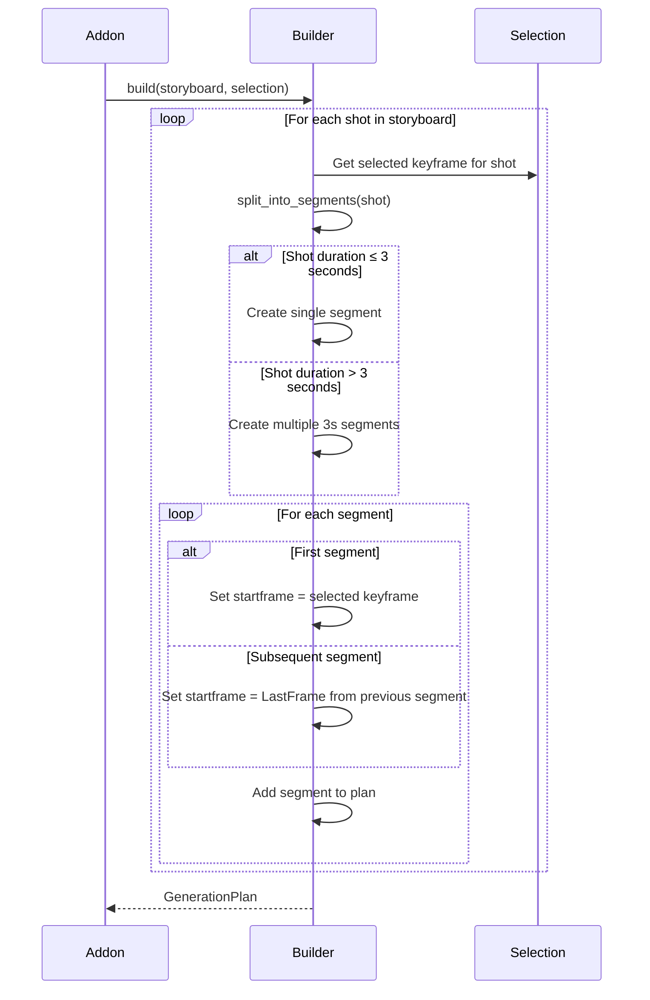
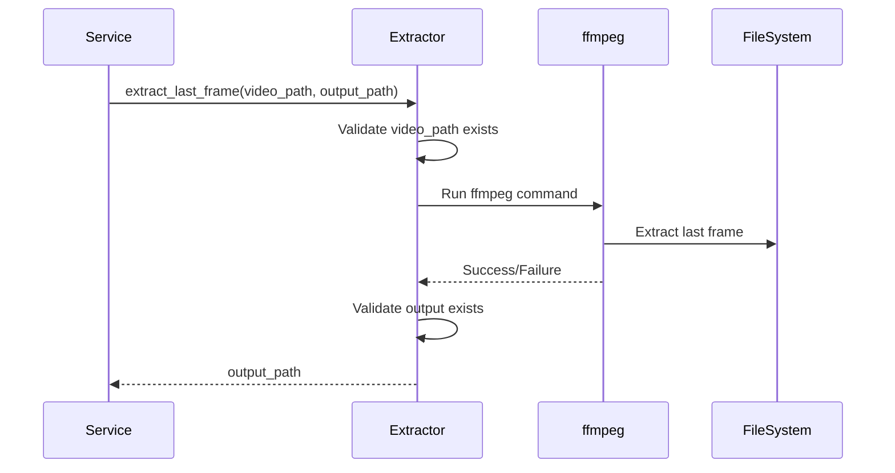
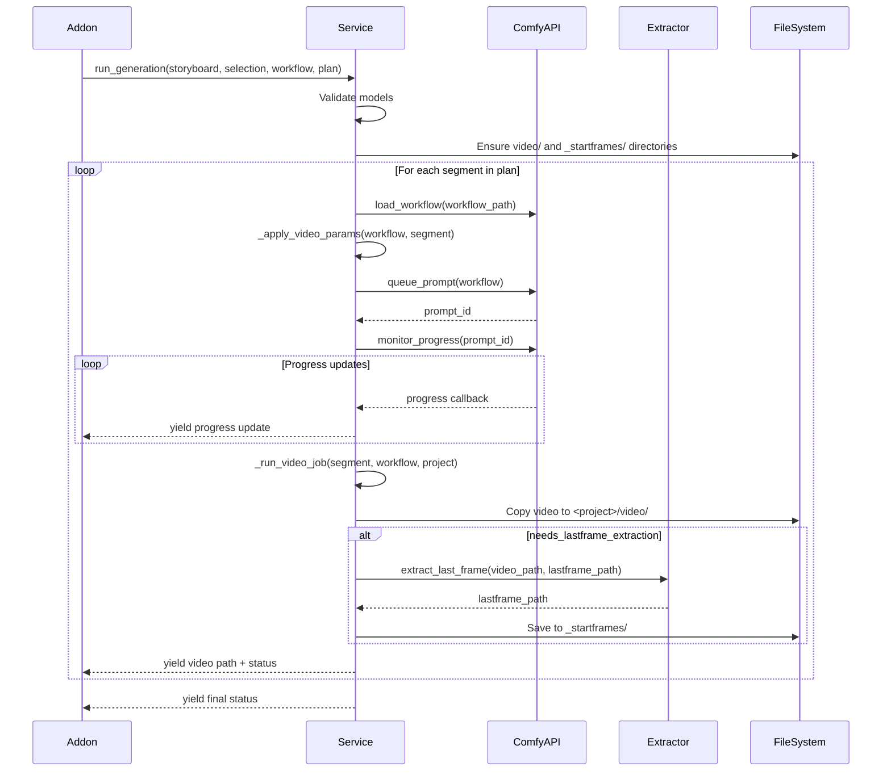

# Video Services

**Files:**
- `services/video/video_generation_service.py` (~500 lines, 100% coverage)
- `services/video/video_plan_builder.py` (~200 lines, 100% coverage)
- `services/video/last_frame_extractor.py` (~100 lines, 100% coverage)

**Purpose:** Encapsulate all business logic for video generation, including plan building, segmentation, LastFrame chaining, and ComfyUI interaction.

---

## Overview

The Video Service layer consists of three specialized services:

1. **VideoGenerationService** - Orchestrates video generation workflow
2. **VideoPlanBuilder** - Creates generation plan with segmentation
3. **LastFrameExtractor** - Extracts last frames using ffmpeg for segment chaining

These services work together to handle complex video generation scenarios, including:
- Multi-segment videos (shots >3 seconds)
- LastFrame chaining for smooth transitions
- Model validation before generation
- Progress tracking and state updates

---

## VideoPlanBuilder

**Location:** `services/video/video_plan_builder.py`

**Coverage:** 100%

**Purpose:** Build generation plan by analyzing storyboard and splitting shots into segments

---

### Class Structure

```python
class VideoPlanBuilder:
    def __init__(self, max_segment_seconds=3.0):
        self.max_segment_seconds = max_segment_seconds

    def build(self, storyboard, selection) -> GenerationPlan
    def split_into_segments(self, shot) -> List[Segment]
```

---

### Main Methods

#### `build(storyboard, selection) -> GenerationPlan`

**Purpose:** Create complete generation plan from storyboard and selection

**Parameters:**
- `storyboard` (Storyboard) - Loaded storyboard object
- `selection` (dict) - Selection JSON with selected keyframes

**Returns:** GenerationPlan object (list of segments)

**Workflow:**


**Example Plan (Shot with 5s duration):**
```python
[
    {
        "shot_id": "001",
        "segment_index": 0,
        "startframe": "/path/to/selected/cathedral_v2.png",
        "prompt": "gothic cathedral interior, cinematic",
        "negative_prompt": "blurry, low quality",
        "duration": 3.0,
        "width": 1024,
        "height": 576,
        "output_file": "shot_001_seg_0.mp4",
        "needs_lastframe_extraction": True  # More segments follow
    },
    {
        "shot_id": "001",
        "segment_index": 1,
        "startframe": "_startframes/shot_001_lastframe_0.png",  # LastFrame from seg 0
        "prompt": "gothic cathedral interior, cinematic",
        "negative_prompt": "blurry, low quality",
        "duration": 2.0,  # Remaining duration
        "width": 1024,
        "height": 576,
        "output_file": "shot_001_seg_1.mp4",
        "needs_lastframe_extraction": False  # Last segment
    }
]
```

**Returns:** List of segment dicts

---

#### `split_into_segments(shot) -> List[Segment]`

**Purpose:** Split shot into segments if duration > max_segment_seconds

**Parameters:**
- `shot` (Shot) - Shot object from storyboard

**Returns:** List of Segment objects

**Algorithm:**
```python
def split_into_segments(shot):
    segments = []
    remaining_duration = shot.duration
    segment_index = 0

    while remaining_duration > 0:
        segment_duration = min(remaining_duration, self.max_segment_seconds)

        segment = Segment(
            index=segment_index,
            duration=segment_duration,
            is_final=(remaining_duration <= self.max_segment_seconds)
        )

        segments.append(segment)
        remaining_duration -= segment_duration
        segment_index += 1

    return segments
```

**Examples:**
- 3.0s shot → 1 segment (3.0s)
- 5.0s shot → 2 segments (3.0s, 2.0s)
- 9.0s shot → 3 segments (3.0s, 3.0s, 3.0s)
- 10.0s shot → 4 segments (3.0s, 3.0s, 3.0s, 1.0s)

**Note:** See BACKLOG.md Issue #004 about padding for non-multiple durations

---

## LastFrameExtractor

**Location:** `services/video/last_frame_extractor.py`

**Coverage:** 100%

**Purpose:** Extract last frame from video using ffmpeg

---

### Class Structure

```python
class LastFrameExtractor:
    def extract_last_frame(self, video_path, output_path) -> str
    def _run_ffmpeg(self, video_path, output_path) -> None
```

---

### Main Methods

#### `extract_last_frame(video_path, output_path) -> str`

**Purpose:** Extract last frame from video file

**Parameters:**
- `video_path` (str) - Path to source video
- `output_path` (str) - Path to save extracted frame

**Returns:** Path to extracted frame PNG

**Workflow:**


**ffmpeg Command:**
```bash
ffmpeg -sseof -1 -i <video_path> -update 1 -q:v 1 <output_path>
```

**Flags:**
- `-sseof -1` - Seek to 1 second before end of file
- `-i <video_path>` - Input video
- `-update 1` - Overwrite output if exists
- `-q:v 1` - Highest quality (1 = best)
- `<output_path>` - Output PNG

**Returns:** Path to extracted PNG

**Error Handling:**
- Raises FileNotFoundError if video doesn't exist
- Raises RuntimeError if ffmpeg fails
- Raises RuntimeError if output not created
- Logs ffmpeg stderr on error

---

## VideoGenerationService

**Location:** `services/video/video_generation_service.py`

**Coverage:** 100%

**Purpose:** Orchestrate video generation workflow

---

### Class Structure

```python
class VideoGenerationService:
    def __init__(self, project_store, model_validator, state_store, plan_builder=None):
        self.project_store = project_store
        self.model_validator = model_validator
        self.state_store = state_store
        self.plan_builder = plan_builder or VideoPlanBuilder()
        self.extractor = LastFrameExtractor()

    def run_generation(self, storyboard, selection, workflow_path, plan) -> Generator
    def _run_video_job(self, segment, workflow, project)
    def _apply_video_params(self, workflow, segment)
```

---

### Main Methods

#### `run_generation(storyboard, selection, workflow_path, plan) -> Generator`

**Purpose:** Execute video generation plan

**Parameters:**
- `storyboard` (Storyboard) - Storyboard object
- `selection` (dict) - Selection JSON
- `workflow_path` (str) - Path to Wan workflow
- `plan` (list) - Generation plan from VideoPlanBuilder

**Returns:** Generator yielding progress tuples

**Workflow:**


**Yields:**
```python
(
    status_markdown,      # "Generating shot 3/5, segment 2/2"
    progress_details_md,  # "Prompt: cathedral, Duration: 2s, Startframe: lastframe_0.png"
    video_path,          # Path to last completed video
    state_dict           # UI state for persistence
)
```

**State Updates:**
```python
state_dict = {
    "storyboard_file": "storyboard_v1.json",
    "selection_file": "selected_keyframes.json",
    "workflow_file": "Wan 2.2 14B i2v.json",
    "last_video_path": video_path,
    "updated_at": timestamp
}
```

**Error Handling:**
- Validates models before starting → yields error if missing
- Catches ComfyUI errors → yields error message, continues with next segment
- Catches ffmpeg errors → logs warning, continues (segment may not chain properly)
- Uses `@handle_errors` decorator

---

#### `_apply_video_params(workflow, segment) -> dict`

**Purpose:** Inject segment parameters into Wan workflow

**Parameters:**
- `workflow` (dict) - Loaded Wan workflow JSON
- `segment` (dict) - Segment from generation plan

**Workflow:**
1. Update LoadImage node:
   ```python
   workflow = LoadImageUpdater().update(workflow, {
       "image": segment["startframe"]
   })
   ```

2. Update CLIPTextEncode nodes:
   ```python
   workflow = CLIPTextEncodeUpdater().update(workflow, {
       "prompt": segment["prompt"],
       "negative_prompt": segment["negative_prompt"]
   })
   ```

3. Update HunyuanVideoSampler:
   ```python
   num_frames = int(segment["duration"] * fps)  # fps = 24
   workflow = HunyuanVideoSamplerUpdater().update(workflow, {
       "num_frames": num_frames
   })
   ```

4. Update EmptyLatentImage:
   ```python
   workflow = EmptyLatentImageUpdater().update(workflow, {
       "width": segment["width"],
       "height": segment["height"]
   })
   ```

5. Update SaveImage:
   ```python
   workflow = SaveImageUpdater().update(workflow, {
       "filename_prefix": f"shot_{segment['shot_id']}_seg_{segment['segment_index']}"
   })
   ```

**Returns:** Updated workflow dict

---

#### `_run_video_job(segment, workflow, project)`

**Purpose:** Queue and monitor single video generation job

**Parameters:**
- `segment` (dict) - Segment metadata
- `workflow` (dict) - Updated workflow
- `project` (dict) - Project metadata

**Workflow:**
1. Queue prompt to ComfyUI
2. Monitor progress via WebSocket
3. Get output video from ComfyUI
4. Copy to `<project>/video/`
5. If `needs_lastframe_extraction` → extract LastFrame

**Returns:** Path to generated video

**Error Handling:**
- Raises if ComfyUI queue fails
- Raises if video copy fails
- Logs warning if LastFrame extraction fails (continues)

---

## Testing Strategy

### Unit Tests

**Coverage:** 100% (all three services)

**Test Files:**
- `tests/unit/services/video/test_video_generation_service.py`
- `tests/unit/services/video/test_video_plan_builder.py`
- `tests/unit/services/video/test_last_frame_extractor.py`

**Key Test Cases:**

**VideoPlanBuilder:**
- `test_build_plan()` - Full plan generation
- `test_split_single_segment()` - 3s or less shot
- `test_split_multiple_segments()` - >3s shot
- `test_segment_startframe_assignment()` - FirstKeyframe vs LastFrame

**LastFrameExtractor:**
- `test_extract_last_frame_success()` - Successful extraction
- `test_extract_last_frame_missing_video()` - FileNotFoundError
- `test_extract_last_frame_ffmpeg_failure()` - RuntimeError
- `test_ffmpeg_command_construction()` - Correct command

**VideoGenerationService:**
- `test_run_generation_single_segment()` - Simple shot
- `test_run_generation_multi_segment()` - Shot >3s with chaining
- `test_apply_video_params()` - Workflow updates
- `test_run_video_job()` - Job execution
- `test_model_validation_failure()` - Missing models

### Integration Tests

**Manual Testing:**
1. Complete full pipeline (Storyboard → Keyframes → Selection)
2. Create storyboard with mixed durations:
   - Shot 1: 3s (single segment)
   - Shot 2: 5s (2 segments with chaining)
   - Shot 3: 10s (4 segments with chaining)
3. Go to Video Generator → Build Plan
4. Verify plan shows correct segmentation
5. Start generation → Monitor progress
6. Verify videos in `<project>/video/`:
   - shot_001_seg_0.mp4 (3s)
   - shot_002_seg_0.mp4 (3s) + shot_002_seg_1.mp4 (2s)
   - shot_003_seg_0/1/2/3.mp4 (3s each + 1s final)
7. Verify LastFrames in `_startframes/`:
   - shot_002_lastframe_0.png
   - shot_003_lastframe_0/1/2.png
8. Verify smooth transitions between segments (visual check)

---

## Common Modifications

### Add Custom Segmentation Strategy

**Example:** Use different segment sizes

**Steps:**
```python
class CustomVideoPlanBuilder(VideoPlanBuilder):
    def __init__(self, max_segment_seconds=5.0):
        super().__init__(max_segment_seconds)

    def split_into_segments(self, shot):
        # Custom logic (e.g., adaptive based on shot complexity)
        pass
```

---

### Add Wan Motion Parameters

**Example:** Use wan_motion from storyboard

**Steps:**
```python
def _apply_video_params(self, workflow, segment):
    # ... existing updates

    if segment.get("wan_motion"):
        workflow = HunyuanVideoSamplerUpdater().update(workflow, {
            "embedded_guidance_scale": segment["wan_motion"]["strength"]
        })

    return workflow
```

---

### Add Video Concatenation

**Example:** Concatenate all segments into final video

**Steps:**
```python
def concatenate_segments(self, shot_id, segments, output_path):
    # Create concat file for ffmpeg
    concat_file = f"/tmp/concat_{shot_id}.txt"
    with open(concat_file, 'w') as f:
        for segment in segments:
            f.write(f"file '{segment['output_file']}'\n")

    # Run ffmpeg concat
    cmd = f"ffmpeg -f concat -safe 0 -i {concat_file} -c copy {output_path}"
    subprocess.run(cmd, shell=True, check=True)

    return output_path
```

---

## Related Documentation

- **Addon:** `docs/addons/VIDEO_GENERATOR.md`
- **Architecture:** `docs/README.md` - Service layer and video workflow sections
- **ROADMAP:** `ROADMAP.md` - v0.7.0 video enhancements
- **BACKLOG:** `BACKLOG.md` - Issue #004 (video padding)
- **Tests:** `tests/unit/services/video/`

---

**Last Updated:** December 13, 2025
**Version:** v0.5.1
