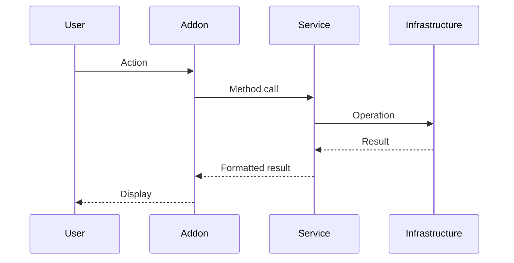

# Change Request: [Short Descriptive Title]

**Date:** YYYY-MM-DD
**Author:** [Your Name / AI Assistant]
**Type:** Feature | Enhancement | Bugfix | Refactoring | Documentation
**Priority:** High | Medium | Low
**Status:** Proposed | In Progress | Completed | Rejected

---

## 📋 Summary

[One-paragraph summary of what this change does and why it's needed]

---

## 🎯 Context

### Problem Statement
[Describe the problem or need that motivated this change]

### Current Behavior
[Describe how the system currently works]

### Desired Behavior
[Describe how the system should work after this change]

---

## 🔍 Affected Components

### Addons
- [ ] 📁 Project Panel
- [ ] 📖 Storyboard Editor
- [ ] 🎬 Keyframe Generator
- [ ] ✅ Keyframe Selector
- [ ] 🎥 Video Generator
- [ ] 🧪 Test ComfyUI
- [ ] ⚙️ Settings

### Services
- [ ] KeyframeService / KeyframeGenerationService
- [ ] SelectionService
- [ ] VideoService / VideoGenerationService / VideoPlanBuilder / LastFrameExtractor

### Infrastructure
- [ ] ComfyAPI Client / Node Updaters
- [ ] ProjectStore
- [ ] ConfigManager
- [ ] WorkflowRegistry
- [ ] StateStore
- [ ] Logger / ErrorHandler

### Domain
- [ ] Models
- [ ] Validators
- [ ] StoryboardService
- [ ] Exceptions

### Other
- [ ] Tests
- [ ] Documentation
- [ ] Configuration files
- [ ] Dependencies (requirements.txt)

---

## 📚 Required Reading

*List the documentation files that must be read to understand this change*

- [ ] `docs/README.md` (Architecture overview)
- [ ] `docs/addons/[SPECIFIC_ADDON].md`
- [ ] `docs/services/[SPECIFIC_SERVICE].md`
- [ ] `ROADMAP.md` (if adding planned feature)
- [ ] `BACKLOG.md` (if fixing known issue - reference issue #)
- [ ] Other: _______________

---

## 🛠️ Implementation Plan

### Step 1: [First Step]
**Affected Files:**
- `path/to/file1.py`
- `path/to/file2.py`

**Changes:**
```python
# Pseudo-code or actual code snippet
def new_method(param1, param2):
    # Implementation
    pass
```

**Rationale:** [Why this change is needed]

---

### Step 2: [Second Step]
**Affected Files:**
- `path/to/file3.py`

**Changes:**
```python
# Code changes
```

**Rationale:** [Why this change is needed]

---

### Step 3: [Third Step, etc.]
[Continue as needed]

---

## 🧪 Testing Strategy

### Unit Tests

**New Tests to Write:**
- [ ] `test_file_name.py::test_new_functionality`
  - **Purpose:** Test that new feature works correctly
  - **Coverage:** Should cover success case, error cases, edge cases

- [ ] `test_file_name.py::test_existing_functionality_not_broken`
  - **Purpose:** Ensure existing behavior unchanged

**Modified Tests:**
- [ ] `existing_test.py::test_method` - Update for new signature

### Integration Tests
- [ ] Test end-to-end workflow with new changes
- [ ] Test interaction with ComfyUI (if applicable)

### Manual Testing Checklist
- [ ] Step 1: [Specific action to test]
- [ ] Step 2: [Expected result]
- [ ] Step 3: [Verify no regressions]
- [ ] Test with sample project: [project name/description]

### Coverage Target
- **Current Coverage:** __%
- **Expected After Change:** __% (maintain ≥75%)

---

## 📝 Files Changed

### Created Files
```
path/to/new_file1.py
path/to/new_file2.py
tests/unit/test_new_feature.py
docs/addons/NEW_ADDON.md (if new addon)
```

### Modified Files
```
path/to/modified_file1.py
  - Line XX: Added new method
  - Line YY: Modified validation logic

path/to/modified_file2.py
  - Line ZZ: Updated to use new service method
```

### Deleted Files
```
path/to/obsolete_file.py (if applicable)
```

---

## ⚠️ Breaking Changes

### API Changes
[List any changes to public method signatures, return types, etc.]

**Example:**
```python
# Old signature
def generate_keyframes(storyboard, workflow, variants):
    pass

# New signature
def generate_keyframes(storyboard, workflow, variants, cfg_scale=7.0):
    pass
```

**Migration Path:** [How to update existing code/usage]

### Configuration Changes
[Any changes to settings.json, workflow_presets.json, etc.]

### Data Format Changes
[Any changes to JSON formats, file structures, etc.]

### Backward Compatibility
- [ ] Fully backward compatible
- [ ] Requires migration (see migration notes below)
- [ ] Breaking change (major version bump required)

**Migration Notes:**
```
[Step-by-step migration instructions if not backward compatible]
```

---

## 🔄 Dependencies

### New Dependencies
[Any new packages added to requirements.txt]

```
package-name==version  # Purpose: What it's used for
```

### Updated Dependencies
[Any version bumps]

```
existing-package==old-version → ==new-version  # Reason: Why upgrade needed
```

---

## 🚀 Deployment Notes

### Pre-Deployment Checklist
- [ ] All tests passing (pytest)
- [ ] Coverage ≥75%
- [ ] Pre-commit hooks pass
- [ ] Documentation updated
- [ ] CHANGELOG.md entry added

### Deployment Steps
1. Pull latest changes
2. Update dependencies: `pip install -r requirements.txt`
3. Run migrations (if applicable): [migration commands]
4. Restart application: `./start.sh`
5. Verify functionality: [specific checks]

### Post-Deployment Verification
- [ ] Test connection to ComfyUI
- [ ] Test affected workflow end-to-end
- [ ] Check logs for errors: `tail -f logs/pipeline.log`
- [ ] Verify no regressions in other features

---

## 📊 Performance Impact

### Expected Performance Changes
[Describe any expected performance improvements or degradation]

**Benchmarks (if applicable):**
```
Before: [metric] = [value]
After:  [metric] = [value]
Change: [improvement/degradation]
```

### Resource Usage
- **Memory:** [Increased/Decreased/No change]
- **CPU:** [Increased/Decreased/No change]
- **Disk:** [Additional space needed?]
- **Network:** [Additional API calls?]

---

## 🔗 Related Changes

### Depends On
[List any other changes that must be completed first]

- Change #XXX: [Title]
- Issue #YYY: [Title]

### Blocks
[List any changes that are blocked by this one]

- Change #ZZZ: [Title]

### Related Issues/Features
[Link to ROADMAP.md features or BACKLOG.md issues]

- ROADMAP.md: v0.X.0 - [Feature Name]
- BACKLOG.md: Issue #XXX

---

## 📖 Documentation Updates

### Documentation Files Updated
- [ ] `docs/README.md` - [What was changed]
- [ ] `docs/addons/[ADDON].md` - [What was changed]
- [ ] `docs/services/[SERVICE].md` - [What was changed]
- [ ] `../README.md` (user guide) - [What was changed]
- [ ] `../CHANGELOG.md` - Entry added

### New Documentation Created
- [ ] `docs/addons/NEW_ADDON.md` (if new addon)
- [ ] `docs/services/NEW_SERVICE.md` (if new service)

### Documentation Review Needed
- [ ] Technical accuracy verified
- [ ] Code examples tested
- [ ] Links verified
- [ ] Spelling/grammar checked

---

## ✅ Acceptance Criteria

*List specific, testable criteria that must be met for this change to be accepted*

- [ ] Criterion 1: [Specific measurable outcome]
- [ ] Criterion 2: [Specific measurable outcome]
- [ ] Criterion 3: [Specific measurable outcome]
- [ ] All tests passing (428+ tests)
- [ ] Coverage maintained at ≥75%
- [ ] No new warnings/errors in logs
- [ ] Manual testing completed successfully
- [ ] Documentation updated
- [ ] Code review approved (if applicable)

---

## 🤔 Alternatives Considered

### Alternative 1: [Approach Name]
**Description:** [How this alternative would work]

**Pros:**
- Pro 1
- Pro 2

**Cons:**
- Con 1
- Con 2

**Why Rejected:** [Reason]

---

### Alternative 2: [Approach Name]
[Same structure as Alternative 1]

---

## 💡 Future Enhancements

*Optional improvements that could be made later but are out of scope for this change*

- Enhancement 1: [Description]
- Enhancement 2: [Description]

---

## 📝 Notes

### Development Notes
[Any notes during implementation that future developers should know]

### Known Limitations
[Any limitations of this implementation]

### Technical Debt
[Any technical debt introduced by this change that should be addressed later]

---

## 📸 Screenshots / Diagrams

### Before
[Screenshot or description of UI/behavior before change]

### After
[Screenshot or description of UI/behavior after change]

### Sequence Diagram (if applicable)


---

## 🔍 Code Review Checklist

### Code Quality
- [ ] Follows existing code style and patterns
- [ ] Proper error handling with try/except and @handle_errors
- [ ] Logging at appropriate levels (info/warning/error)
- [ ] Type hints used where applicable
- [ ] Docstrings for new methods/classes
- [ ] No hardcoded values (use config/constants)
- [ ] No commented-out code
- [ ] No debug print statements

### Architecture
- [ ] Follows layered architecture (Addon → Service → Infrastructure → Domain)
- [ ] Business logic in service layer, not addon
- [ ] Validation using Pydantic models
- [ ] Proper exception handling with custom exceptions
- [ ] Dependencies injected (not hardcoded)

### Testing
- [ ] Unit tests for all new methods
- [ ] Tests cover success and error cases
- [ ] Tests cover edge cases
- [ ] Mocks used appropriately
- [ ] Tests are deterministic (no random failures)

### Documentation
- [ ] All changes documented
- [ ] Examples provided where helpful
- [ ] README.md navigation matrix updated if needed
- [ ] CHANGELOG.md updated

---

## ✍️ CHANGELOG Entry

**Version:** v0.X.X
**Date:** YYYY-MM-DD

### [Type] - [Component]
- [Change description in user-facing language]
- [Another change if applicable]

**Example:**
```markdown
### Enhancement - Video Generator
- Added CFG scale control for fine-tuning video generation quality
- Improved progress reporting during segmented video generation
```

---

**Change Request Created:** YYYY-MM-DD
**Last Updated:** YYYY-MM-DD
**Status:** [Current Status]
